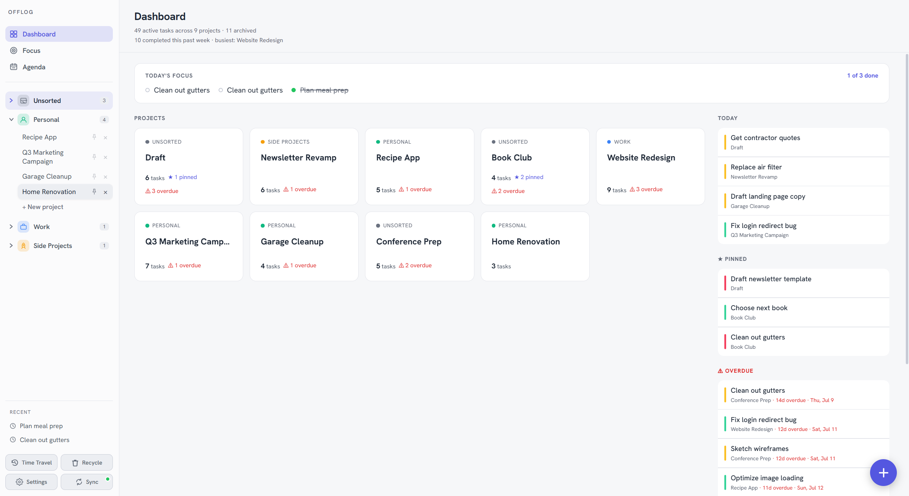
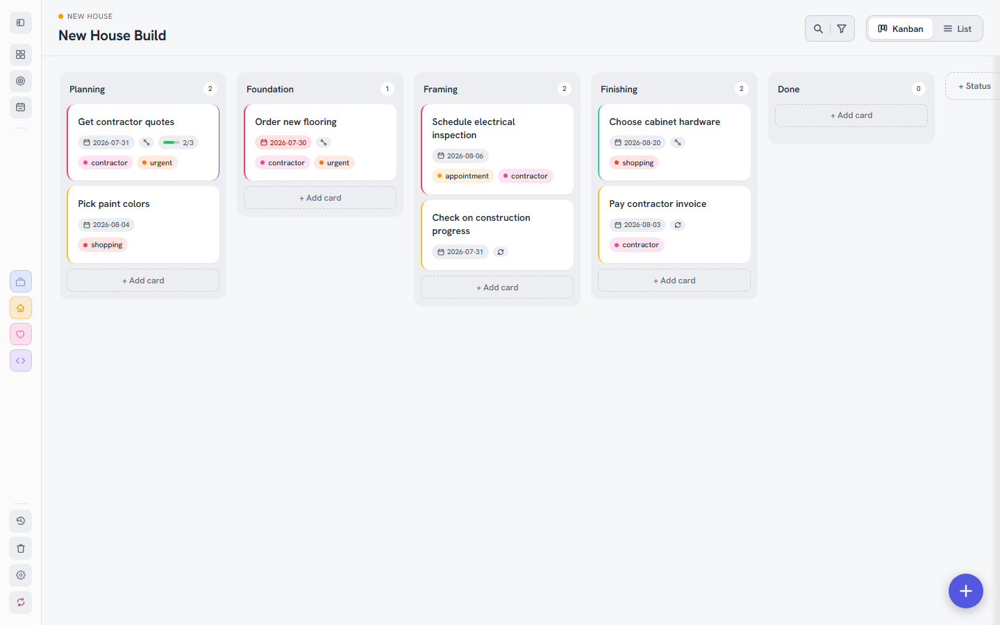
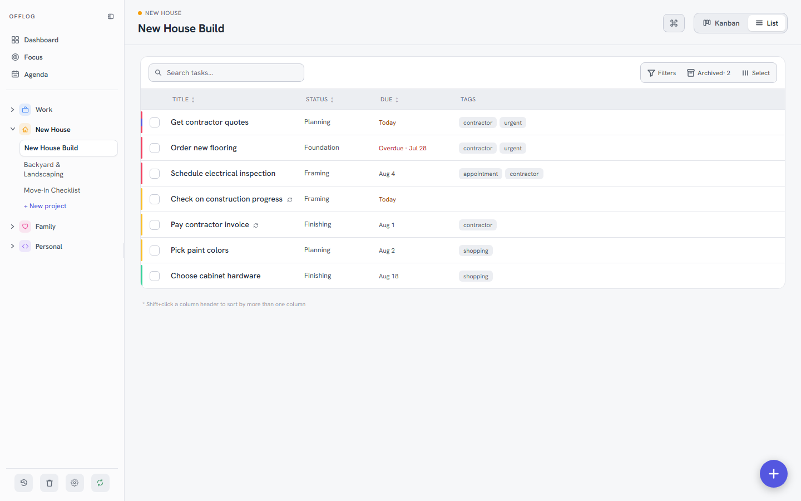
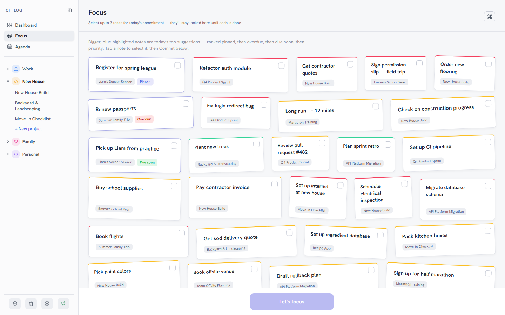
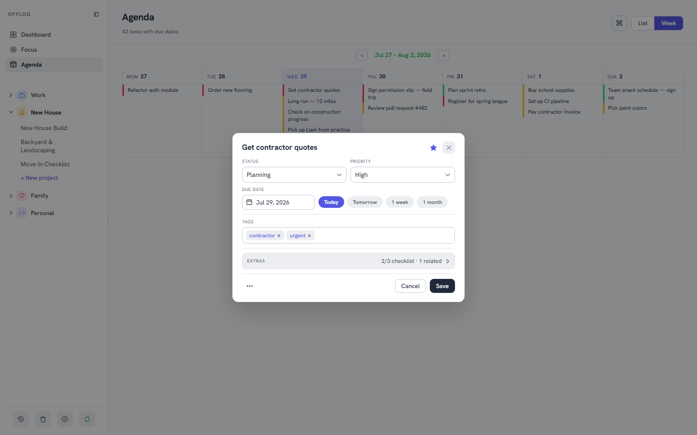
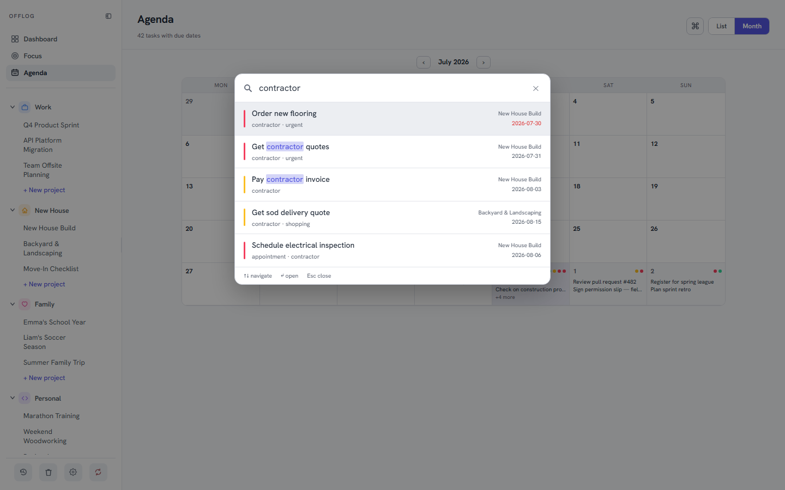
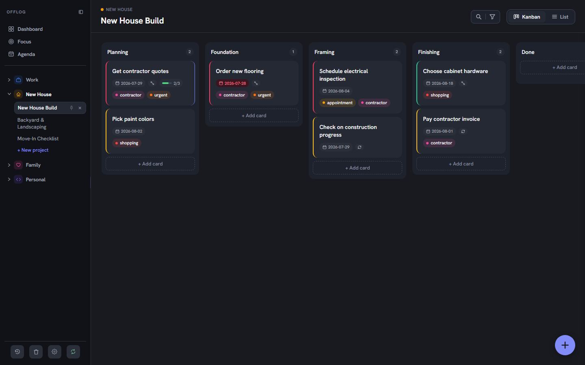

<p align="center">
  
</p>

<p align="center">
  <a href="LICENSE"></a>
  <a href="https://github.com/hrach-gevorgyan/offlog/releases/latest"></a>
  <a href="https://github.com/hrach-gevorgyan/offlog/actions/workflows/ci.yml"></a>
  <a href="https://github.com/hrach-gevorgyan/offlog/commits/main"></a>
  
  <a href="https://github.com/hrach-gevorgyan/offlog/releases"></a>
</p>

<p align="center">
  
  
  
  
  
</p>

# Offlog

**Your tasks. Your devices. Nobody else's.**
*Off the cloud, still logged.*

A free, open-source, local-first task manager. No account, no telemetry,
no subscription, ever. Runs in the browser, as a native Android app, and
as a Windows desktop app — all three share the exact same codebase and
sync with each other over your own network. (Current version: the
badge above, always live — [docs/CHANGELOG.md](docs/CHANGELOG.md) for
what changed.)

**Jump to:** [Screenshots](#screenshots) ·
[Why this exists](#why-this-exists) · [Features](#features) ·
[Getting the apps](#getting-the-apps) ·
[Getting Started](#getting-started) ·
[Documentation](#documentation) · [Contributing](#contributing)

## Screenshots

Real captures from a real build — no mockups, no Lorem Ipsum.

<table>
  <tr>
    <td width="50%" align="center">
      
      <br><sub><b>Dashboard</b> — every project at a glance, pinned and overdue tasks up front</sub>
    </td>
    <td width="50%" align="center">
      
      <br><sub><b>Kanban</b> — drag-and-drop columns, per-card due dates, tags, and checklist progress</sub>
    </td>
  </tr>
  <tr>
    <td width="50%" align="center">
      
      <br><sub><b>List</b> — sortable columns, saved filters, multi-column sort</sub>
    </td>
    <td width="50%" align="center">
      
      <br><sub><b>Focus</b> — pick up to 3 tasks for today, ranked pinned → overdue → due-soon</sub>
    </td>
  </tr>
  <tr>
    <td width="50%" align="center">
      
      <br><sub><b>Task detail</b> — full editor over Agenda's week calendar</sub>
    </td>
    <td width="50%" align="center">
      
      <br><sub><b>Search (Ctrl+K)</b> — one box for tasks, notes, checklist text, and commands</sub>
    </td>
  </tr>
</table>

<p align="center">
  
  <br><sub>Light or dark — every screen, not just a toggle that half-works</sub>
</p>

---

## Why this exists

Offlog is a task manager built to have exactly the features one person
actually uses and nothing they didn't ask for, syncing only across
devices they own — a phone and a PC on the same Wi-Fi — never through
someone else's cloud. It works fully offline, and when sync is turned
on, your phone and PC talk to each other directly. No account to
create, no subscription, no feature ever held back behind a paywall.

It started as a personal tool, but the sync model works just as well
for a small, trusted, co-located group: a family, a small team, or one
office sharing a single board over the same network. It is **not** a
remote/multi-tenant product — there are no accounts, no per-user
permissions, and syncing only ever happens on the same local network.
See [docs/DECISIONS.md](docs/DECISIONS.md)'s opening manifesto for the
exact scope and why it stops there.

It's also built in the open, on purpose. Every decision — including the
ones that got reversed — is written down:
[docs/DECISIONS.md](docs/DECISIONS.md) (the mission, plus why the
non-obvious choices were made, including the ones an outsider would
reasonably ask "why not just—"), [docs/ROADMAP.md](docs/ROADMAP.md)
(what's planned and why), [docs/TECH.md](docs/TECH.md) (the real
architecture), and a full [docs/CHANGELOG.md](docs/CHANGELOG.md) going
back to the first release.

One shared codebase — the same Svelte app wrapped three ways (browser,
Android, Windows) — with each device keeping its own local database and
syncing peer-to-peer over your own Wi-Fi when you turn it on. No cloud
service ever sits in the middle. See [docs/TECH.md](docs/TECH.md) for
exactly how that works.

## Features

Built up from months of real daily use — some features came from the
original plan, plenty came from just noticing something was missing
while using the app for real. Full detail on all of it:
[docs/CHANGELOG.md](docs/CHANGELOG.md) (recent releases) and
[docs/archive/changelog-archive.md](docs/archive/changelog-archive.md)
(everything older, one line per release).

**Core task management**
- Spaces & Projects — organize work into colored spaces, each holding
  multiple projects, each with its own set of statuses
- Kanban, List, Table, and Agenda (deadline-focused) views per project,
  with saved filters, column selection/reordering, and multi-column sort
  in List/Table
- Focus view — a daily-commitment lock: pick up to 3 tasks for the day
  from a round-robin-ranked picker, instead of an auto-computed priority
  list nobody trusts
- Checklists with a progress badge, tags with project-local
  autocomplete and an optional per-tag color, custom fields (global, not
  per-project)
- Card detail — full task editor: notes with a length counter, priority,
  due date, reminder time (independent of due date), status, checklist,
  custom fields, related-task links, file attachments, and a per-card
  changelog of every change made to it
- File attachments — photos, PDFs, spreadsheets, or any other file
  (except HEIC/HEIF, not supported yet), up to 10MB each and 10 per
  task. Images are downscaled and re-encoded on-device before saving,
  so a phone photo doesn't balloon your database. Attachments sync like
  everything else — no separate upload step
- Recurring tasks (daily/weekly/monthly) — one task resets in place
  instead of spawning a duplicate, correctly handles month-end dates
  (a task due the 31st lands on the 28th/29th/30th of a shorter month,
  not two months later) and DST transitions
- One-tap due-date shortcuts on task creation; Duplicate task; project
  templates (copy a status structure, optionally with its open tasks)
- Dashboard — every project at a glance, pinned tasks, overdue tasks,
  a weekly "N completed this past week" summary
- Quick Add (Ctrl+N) and Global Search (Ctrl+K) from anywhere — search
  covers task titles, notes, and checklist text, not just titles — plus
  a command palette that matches actions, not just tasks
- Undo & Recycle — soft-delete everywhere with undo, a full Recycle view
  with restore/delete-forever, and a configurable retention policy

**Sync — this is the core idea, not a bolt-on**

Local phone-to-PC (and PC-to-PC) sync was the entire reason this project
started: one task list, always current, on every device you own, without
handing it to a cloud provider. Most self-hosted, local-first apps stop at
"sync is possible if you set up your own server" — that's a real barrier
for anyone who isn't comfortable running one. Offlog's Windows app *is*
the server: it bundles [NyxDB](https://github.com/hrach-gevorgyan/nyxdb)
(a small, self-authored CouchDB-protocol server), configures itself on
first launch, and your phone finds it on the network automatically. The
technical pieces (CouchDB-protocol replication, mDNS discovery, a
paired-handshake credential exchange) aren't novel on their own —
packaging all three together so a non-technical person never sees any
of them is the actual point. (Real Apache CouchDB was the original
embedded server through v5.7.10; swapped for NyxDB after that to cut
installer size roughly 10x — full history in
[docs/DECISIONS.md](docs/DECISIONS.md).)

- Live bidirectional replication over the CouchDB protocol — a write on
  one device shows up on the other in real time whenever both are
  reachable on the same network
- The Windows desktop app **bundles NyxDB itself** — nothing to
  install separately, no server admin knowledge required. On first
  launch it silently generates its own random port, admin password, and
  database identity, and runs NyxDB as a managed background process
  the whole time the app is open
- Your phone discovers the PC automatically over mDNS (`_offlog._tcp`)
  and pairs with a one-time 6-digit code shown on the PC — no manually
  typing an IP address, no shared credentials sent over the air until
  pairing actually happens, and the code locks out after repeated wrong
  guesses
- If your PC's address changes (DHCP renewal, router reboot), the phone
  automatically re-resolves it on the next failed sync instead of
  requiring a manual re-pair
- The app works fully offline with zero setup if you never turn sync on;
  offline detection, human-readable sync errors, and a conflict
  resolution UI mean a lost connection is visible and recoverable, never
  silent data loss
- Free-form per-device names with a stable underlying device id, plus a
  "Devices seen recently" list

Everything above stays **LAN-only by design** — see
[docs/DECISIONS.md](docs/DECISIONS.md) for why remote/away-from-home
sync and per-user accounts were deliberately kept out of scope.

**Two phones, no PC, want to share data?** Not supported — only the
Windows desktop app can act as the syncing computer that phones connect
to (see DECISIONS.md's mesh-sync entry for the reasoning). Export/Import
(Settings → Backup & Storage) is the way to move data between two phones
that will never share a PC.

**Moving your PC to a new computer?** Everything Offlog needs — your
data and its connection settings — lives in one folder on your old PC
(verified to survive a normal uninstall/reinstall, so this is only
needed if you're switching to different hardware, not reinstalling on
the same machine). Copy that whole folder to the new PC before opening
Offlog there for the first time, and every phone that was already
connected reconnects automatically — no need to reconnect them by hand.
(For anyone curious about the exact folder: `%APPDATA%\com.offlog.app\`
on Windows.)

**Android app — tested and working on a real device**
- Native app via Capacitor, actively used day to day, not just built and
  shelved
- Home-screen widgets for Quick Add, a read-only Agenda, and a Project
  list, for getting a task in or checking what's due without opening the
  app
- Native notifications with "Done"/"Snooze 1h" actions right from the
  lock screen
- Hardware back button closes whatever modal/panel is open, the way it
  should
- Not yet on Google Play — planned; see "Getting the apps" below

**Windows desktop app — the intended "app for humans"**
- Native app via Tauri, wrapping the same web build unmodified, with an
  embedded NyxDB sync host (see Sync above)
- Native Windows notifications with click-to-open and working scheduled
  reminders (not just a browser notification fallback)
- Native "Save As" dialogs for backup/export instead of a silent no-op
  browser download inside a WebView

**Small footprint, on purpose.** Both the Android and Windows apps have
gone through repeated cleanup passes specifically to stay small and
light — dead code removed, unused dependencies dropped, and the
Windows app's embedded sync host switched to a self-authored,
purpose-built server (NyxDB) instead of a general-purpose database
engine, cutting the installer roughly 10x. Bundle-size checks are part
of the release routine. This isn't accidental; a maintenance pass runs
every few releases specifically to catch bloat and regressions before
they ship (see [docs/MAINTENANCE.md](docs/MAINTENANCE.md)).

**Data, backup, and integrity**
- Full Back up (with a scope selector) / Restore flow, JSON and CSV
  export
- A Check Database / Repair Issues tool that finds and fixes orphaned
  tasks/projects, invalid status references, and unresolved sync
  conflicts
- Storage-pressure warnings past 80% usage with cleanup pointers,
  `db.compact()` wired to an actual "Optimize Storage" action

**Appearance & accessibility**
- Light / Dark / System theme, a High Contrast toggle, a Reduce Motion
  toggle that's actually read by every animation in the app
- Keyboard-operable throughout: focus trapping in every modal, visible
  focus rings, a keyboard shortcuts panel, Escape closes everything
- WCAG AA contrast audited and fixed across the palette

No paid tier, no feature ever held back behind one — see
[docs/DECISIONS.md](docs/DECISIONS.md)'s manifesto for why.

## Getting the apps

Download the latest Windows installer and Android APK from
[GitHub Releases](https://github.com/hrach-gevorgyan/offlog/releases).
Your OS will warn you before installing (unsigned app, not from Google
Play) — that's expected, not a red flag on this app's code; getting real
signing/publishing set up is a tracked goal (see
[docs/ROADMAP.md](docs/ROADMAP.md)'s "Open" section — Android's Play
Store listing is ready and waiting on Google's review; Windows signing
applied to [SignPath Foundation](https://signpath.org)'s free
open-source program and was asked to reapply once the project has more
public traction, see [docs/SIGNING.md](docs/SIGNING.md)). Just make
sure you're downloading from this repo's own Releases page, not a
mirror.

**Windows** is the intended app for day-to-day use — bundles its own
sync server, nothing else to install, and checks for updates
automatically (signed installer, in-app changelog, explicit restart
prompt). **Android** works the same way via side-loaded APK today, Play
Store (with its own auto-update) once published. The **web build**
(`npm run dev`) is a dev/test surface, not the primary way to use the
app.

## Built like a real product, not a prototype

Every release: zero-warning production build, clean type check, full
test suite, manual light/dark verification — enforced by CI, with a
maintenance pass every few releases catching dead code and regressions
(see [docs/MAINTENANCE.md](docs/MAINTENANCE.md)). Went through a full
security audit and git-history credential purge before going public
(see [docs/DECISIONS.md](docs/DECISIONS.md)'s "Public release" section).

## Getting Started

Everything below is run from a terminal — there's no GUI installer setup
for development. You're free to use a graphical Git/npm tool if you
prefer one, but every step here has a plain command-line equivalent so
nothing requires one.

**What you need installed**, depending on what you're building:

| Target | Requires |
|---|---|
| Web build | [Node.js](https://nodejs.org/) 20+ (includes npm) |
| Android build | Above, plus [Android Studio](https://developer.android.com/studio) (JDK bundled with it) |
| Windows desktop build | Above, plus [Rust](https://rustup.rs/) + [Tauri's prerequisites](https://tauri.app/start/prerequisites/) |

**Web app** (works fully offline, no setup):

```bash
cd offlog-app
npm install
npm run dev              # http://localhost:5173
```

To enable sync, create `offlog-app/.env.local`:

```
VITE_SYNC_URL=http://192.168.x.x:5984/offlog
VITE_SYNC_USER=youruser
VITE_SYNC_PASS=yourpass
```

Build for web (`npm run build`, output in `offlog-app/dist/`) or Android
(`npx cap sync android` then build via Android Studio or Gradle).

**Windows desktop app** — a sibling project at `offlog-desktop/` (Tauri),
wraps the same web build and embeds a NyxDB sync host (fully
self-contained — no separate server install needed, even for
development):

```bash
cd offlog-desktop
cargo tauri dev
```

Full build/deploy steps, environment details, and the complete
architecture (including exactly how the mDNS discovery and pairing
handshake work) are in [docs/TECH.md](docs/TECH.md).

## Documentation

Everything beyond this pitch lives in [docs/](docs/):

| Document | What's in it |
|---|---|
| [docs/DECISIONS.md](docs/DECISIONS.md) | Manifesto (why this project exists) + why non-obvious choices were made |
| [docs/TECH.md](docs/TECH.md) | Architecture, data model, sync internals, theme tokens |
| [docs/ROADMAP.md](docs/ROADMAP.md) | Current status and still-open planned work |
| [docs/CHANGELOG.md](docs/CHANGELOG.md) | Recent version history in full detail |
| [docs/archive/changelog-archive.md](docs/archive/changelog-archive.md) | Older releases, one line each, plus the full maintenance-pass log |
| [docs/archive/roadmap-archive.md](docs/archive/roadmap-archive.md) | Shipped/declined/parked roadmap history |
| [docs/IDEAS.md](docs/IDEAS.md) | Open questions and un-committed ideas worth outside input |
| [docs/BRAND.md](docs/BRAND.md) | Tagline/pitch/voice/visual-identity reference for public-facing copy |
| [docs/TRADEMARK.md](docs/TRADEMARK.md) | MIT covers the code only — name/icon/tagline usage terms for forks |
| [CLAUDE.md](CLAUDE.md) | Contributor guide/rules for humans and AI assistants |

## Contributing

Built in about a month, solo, with Claude doing the hands-on-keyboard
engineering while every idea, UI decision, and round of testing came
from a single owner acting as product manager and QA — the codebase is
documented (`CLAUDE.md` + `docs/`) specifically so an AI assistant (or a
human) can pick it up the same way for a fork.

There's a real, honest wishlist of help that
would move it forward — see [CONTRIBUTING.md](CONTRIBUTING.md) for setup
and PR mechanics, but in short, the most valuable contributions right
now are:

- Real code-signing (Windows) and Google Play publishing — the build/
  release pipeline itself is already automated (see below), what's
  missing is the paid credentials themselves and someone to own that
  ongoing cost/process
- An iOS build — there's currently no bandwidth to open that front
  solo, so this is entirely open for someone who wants to take it on
- General ideas, fixes, and code review — if something looks like it
  could be simpler, safer, or better structured, that feedback is
  genuinely wanted, not just accepted

The codebase is deliberately structured to be forkable and AI-legible —
[CLAUDE.md](CLAUDE.md) documents the invariants an assistant (or a
human) needs to know before changing `db.ts`, the theming system, or
Android platform code.

## License

MIT — see [LICENSE](LICENSE).
