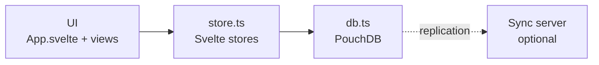

# Offlog — Technical Documentation

Local-first task manager for browser, Android, and Windows. This file is a
reference: what it's built with, how it's laid out, and the few ideas that
aren't obvious from the code.

> Conventions and invariants: [CLAUDE.md](../CLAUDE.md) ·
> Planned work: [ROADMAP.md](ROADMAP.md) ·
> Why choices were made: [DECISIONS.md](DECISIONS.md) ·
> Version history: [CHANGELOG.md](CHANGELOG.md) ·
> Pitch: [README.md](../README.md)

**Contents:** [Stack](#stack) · [Architecture](#architecture) ·
[Source File Map](#source-file-map) · [Data Model](#data-model) ·
[Performance & Reliability](#performance--reliability) ·
[Testing & Dev Workflows](#testing--dev-workflows) ·
[How Sync Works](#how-sync-works) · [Theme System](#theme-system) ·
[Notifications](#notifications) · [Mobile (Android)](#mobile-android) ·
[Desktop (Tauri)](#desktop-tauri)

---

## Stack

| Layer | Technology | Notes |
|---|---|---|
| UI | **Svelte 5** + TypeScript | No virtual DOM, small bundle |
| Build | **Vite 8** | |
| Local database | **PouchDB 9** | IndexedDB in the browser; speaks the CouchDB replication protocol |
| Sync server | Any **CouchDB-protocol** server (CouchDB, or **NyxDB**) | Self-hosted, optional. The app is fully usable without one |
| Android | **Capacitor 7** | Wraps the same `dist/` in a WebView |
| Windows | **Tauri 2** (`offlog-desktop/`) | Wraps the same `dist/`, embeds a NyxDB sync host |
| Notifications | `@capacitor/local-notifications` / Web Notification API | |
| Biometrics | `capacitor-native-biometric` | Android only, opt-in alongside the PIN |
| Privacy screen | `@capacitor/privacy-screen` | Opt-in; also blocks screenshots |
| Clipboard / Haptics / Launcher | `@capacitor/clipboard`, `-haptics`, `-app-launcher` | |
| Styling | CSS custom properties | No CSS framework |
| Fonts | Hanken Grotesk only | `--mono` points at the same face |

---

## Architecture

Four layers, one direction. The UI never touches the database directly for
state; it reads stores and calls `db.ts`.



- **UI** — `App.svelte` routes between Dashboard, Focus, Agenda, Kanban,
  List, plus modals (CardDetail, QuickAdd, GlobalSearch, Settings).
- **store.ts** — the only reactive state layer. Holds spaces, projects,
  tasks and the active selection; reloads on any database change.
- **db.ts** — all reads and writes, the changelog, the undo buffer, and
  sync control.
- **Sync server** — optional. All devices replicate through one database
  named `offlog`.

---

## Source File Map

Paths are relative to `offlog-app/`. Every source file is listed.

```
src/
  App.svelte                    Root: view routing, shortcuts, undo toasts, lock gate
  app.css                       All CSS custom property tokens (light + dark)
  config.ts                     Settings in localStorage + secure sync credentials
  main.ts                       Mount entry; global error handlers; status-bar setup
  vite-env.d.ts                 Types for the host-injected globals (Capacitor, Tauri, PouchDB)

  lib/
    db.ts                       Barrel — import everything from here, never from db/*
    db/
      core.ts                   PouchDB instance, indexes, task cache, logChange, subscribe
      entities.ts               CRUD: spaces, projects, tasks, blocked-by, attachments, undo, trash
      sync.ts                   Live replication, sync state, conflict scan/resolve
      tags.ts                   Tag colour overrides, tag rename/delete
      stats.ts                  Dashboard and storage-breakdown aggregate reads
      maintenance.ts            Retention pruning, integrity check/repair, import/export
    store.ts                    Svelte stores — the only reactive state layer
    types.ts                    SpaceDoc, ProjectDoc, TaskDoc, Column, CustomFieldDef
    constants.ts                Priority colours/labels, default columns
    utils.ts                    Date formatting and task filtering (see table below)
    theme.ts                    Light/dark/system, high contrast, reduce motion
    motion.ts                   Shared transition params (panels, popovers, toasts)
    modalStack.ts               Back-button/Escape close ordering — closeOnBack()
    focusTrap.ts                use:trapFocus action, shared by every modal
    confirm.ts                  confirmAction() — promise wrapper around ConfirmDialog
    commands.ts                 Command palette action list (Ctrl+K)
    discovery.ts                mDNS host discovery + pairing handshake (device side)
    notifications.ts            Reminder scheduling, both platforms
    autoBackup.ts               Silent daily local backup, 7 kept
    attachments.ts              Attachment size cap and extension→mime map
    focusLock.ts                The day's Focus commitment — per-day UI state, never synced
    tagColors.ts                Tag colour: stored override, else deterministic hash
    updateChecker.ts            Desktop update check (Tauri updater plugin)
    spaceIcons.ts               The 25-icon space-icon set and resolver
    logFormat.ts                Turns log: docs into plain English for TimeTravelView
    nlpParse.ts                 parseQuickAdd() — local regex parsing, no network
    haptics.ts                  Single gate for every haptic call (Android only)

    Sidebar.svelte              Spaces, projects, sync indicator, bottom icon row
    DashboardView.svelte        Home: project cards, pinned/overdue panels, daily brief
    FocusView.svelte            Pick up to 3 tasks for the day; corkboard picker
    KanbanBoard.svelte          Drag-and-drop columns (mouse + touch)
    ListView.svelte             List/table with search, filter, sort, archive
    AgendaView.svelte           Flat list (Overdue/Today/This week/Later) + month grid
    FilterBar.svelte            Search + filter row shared by Kanban and List
    TimeTravelView.svelte       log: docs grouped by day, with pagination
    TaskHistoryPanel.svelte     Lazy-loaded history for one task
    QuickAdd.svelte             Ctrl+N fast add; live-parses the title via nlpParse
    GlobalSearch.svelte         Ctrl+K debounced search across all tasks
    TrashView.svelte            Restore or purge soft-deleted tasks

    CardDetail.svelte           Task editor shell: all card state, save(), history
    carddetail/
      RepeatReminderBlock.svelte  Repeat and reminder
      ChecklistBlock.svelte       Checklist
      CustomFieldsBlock.svelte    Custom field values
      RelatedBlock.svelte         Related tasks
      BlockedByBlock.svelte       Blocking dependencies
      AttachmentsBlock.svelte     File attachments
      NotesBlock.svelte           Markdown notes
      helpers.ts                  Pure helpers: dates, summary text, image encoding

    SettingsPanel.svelte        Settings shell: category nav, shared state, save/close
    settings/
      AppearanceSettings.svelte   View & Accessibility
      NotificationSettings.svelte Notifications
      SyncSettings.svelte         Sync and pairing
      OrganizeSettings.svelte     Organize
      DataSettings.svelte         Backup & Storage
      SecuritySettings.svelte     App Lock
      AdvancedSettings.svelte     Advanced (sync URL, maintenance, reset)
      helpers.ts                  Pure helpers: download, storage math, maint steps

    SpaceManager.svelte         Manage spaces
    TagManager.svelte           Manage tags and their colours
    CustomFieldManager.svelte   Manage global custom field definitions
    ArchivedProjectsManager.svelte  Archive and restore projects

    CustomSelect.svelte         Themed dropdown, replaces every native <select>
    CalendarPicker.svelte       Themed date picker
    TimePicker.svelte           Themed time picker
    ConfirmDialog.svelte        Themed confirm(), driven by confirm.ts
    NamePrompt.svelte           First-run "name this device"
    UpdateModal.svelte          Desktop update available/downloading/failed
    AppLock.svelte              PIN lock screen; Escape must not dismiss it
    ConfirmPinGate.svelte       Proves the current PIN before changing or removing it
    PinStar.svelte              The shared pin star icon
```

**Two CSS rules worth knowing**, both learned from real regressions:

- `CardDetail.svelte` and `SettingsPanel.svelte` own their children's
  **class** rules as `:global()` under a parent wrapper, because the markup
  now lives in child components and scoping would drop it.
- Bare **element** rules (`button`, `label`, `textarea`) must stay scoped
  and be copied into each child. A `:global(button)` also matches nested
  components' internal buttons (CustomSelect, CalendarPicker) and restyles
  them.

---

## Data Model

One PouchDB database, `offlog`. The `_id` prefix is the document type.

| Prefix | Type | Key fields |
|---|---|---|
| `space:` | SpaceDoc | `name`, `color`, `icon`, `position` |
| `project:` | ProjectDoc | `space_id`, `name`, `columns[]`, `default_view`, `archived` |
| `task:` | TaskDoc | `project_id`, `column_id`, `title`, `body`, `priority`, `due_date`, `tags`, `deleted`, `archived` |
| `log:` | LogDoc | `ref`, `action`, `diffs`, `ts` |
| `meta:` | Custom field definitions | `fields[]` |
| `tag:` | Tag colour override | `tag`, `color` |

### Rules

- **Done is positional.** A task is complete when its `column_id` is the
  project's **last** column. There is no `done` boolean, so a task can never
  disagree with the column it sits in.
- **Soft delete.** Tasks get `deleted: true` and are never removed. A real
  removal would replicate as an absence and lose the history.
- **Archive.** `archived: true` hides a task from normal views; restorable.
- **Ordering** uses fractional positions, so inserting between two tasks
  never renumbers the rest.
- **Priority** is `1` low, `2` medium, `3` high — shown as a left border.
- **Pinned** always sorts to the top.
- **"Status" vs "Column".** Users see "Status". The stored field is
  `column_id` — a frozen legacy name.
- **Source** records which device made a write, for the changelog.

### Fields with behaviour attached

- **Recurrence** (`daily`/`weekly`/`monthly`, optional interval,
  weekdays-only): one task per series, not a new card per completion.
  Moving it to the last column writes it back to the first with the due
  date advanced from the *original* date, so finishing late doesn't shift
  the schedule. Undo has to restore due date, reminder and checklist too,
  not just the column.
- **Attachments**: bytes live in PouchDB's own `_attachments` on the task,
  so they replicate with it. `TaskAttachment` holds only metadata (`key`,
  filename, type, size, date) — `key` is not the filename, since two files
  can share one. 10 MB per file, 10 per task. Images are downscaled to
  ~1600px and re-encoded to JPEG before saving.
- **Related** (`related[]`): non-directional "see also". Stored only on the
  task the link was added from; the reverse direction is computed at read
  time, because PouchDB cannot write two documents atomically.
- **Blocked by** (`blocked_by[]`): a real directional dependency. Whether a
  blocker is done is computed with the positional rule, so it cannot drift.

---

## Performance & Reliability

**Indexing.** `getTasksForProject()` is the hottest read and uses a Mango
index on `['type', 'project_id']` (~9x faster than a full scan at 5,000
tasks). Note `db.find()` silently defaults to 25 results — always pass an
explicit `limit`.

**Task cache.** Cross-cutting reads (search, dashboard, agenda, tag
autocomplete) each need *every* task, which no index can narrow.
`getAllTasksRaw()` caches that full scan in memory. Invalidation happens
centrally in `subscribe()` and again inside every task-writing function, so
a read can't beat the change listener.

**Crash recovery.** `App.svelte` wraps startup in try/catch and shows a
retry screen rather than hanging. `main.ts` listens for `unhandledrejection`
and `error` as a last resort. Every task-mutating call site is wrapped in
try/catch with `showError()` — an audited invariant.

**Integrity check.** `checkIntegrity()` reports orphaned projects and tasks,
tasks pointing at a status that no longer exists, projects with no statuses,
and unresolved sync conflicts. `repairDatabase()` fixes all but the
no-statuses case, which is left for manual review. Both are exposed in
Settings; repair needs an explicit confirm.

**Automatic backup** (`autoBackup.ts`). Runs at most every ~20h, writing the
same JSON as a manual export to app-private storage (desktop
`appDataDir()/auto-backups/`, Android `Directory.Data`; no-op on web). Keeps
the newest 7. Plain unencrypted JSON, on-device, never uploaded. Failures
are logged and retried next run — the timestamp only advances on success.

### Shared utilities (`utils.ts`)

| Export | Used by |
|---|---|
| `dueLabel` / `dueLabelLong` / `dueRelative` | List, Dashboard, Agenda |
| `dueState` / `dueInk` | ListView |
| `filterTasks` | ListView, Kanban |
| `localDateStr` and friends | everywhere a calendar day matters |

All date-only logic goes through `localDateStr()`. Never use
`toISOString().slice(0, 10)` for a calendar day — it shifts to UTC.

---

## Testing & Dev Workflows

Full test conventions live in [CLAUDE.md](../CLAUDE.md). In short: `db.ts`
logic runs against `pouchdb-adapter-memory`, components run under
`@testing-library/svelte` with `db`/`store` mocked, and three suites test
the real thing — `replication.test.ts` (PouchDB's actual replicator between
two databases), `backupRestore.test.ts` (export → wipe → restore), and
`perfGuard.test.ts` (counts database round-trips, never wall-clock time).

`tests/setup.ts` shims what jsdom lacks: the `PouchDB` global, an in-memory
`localStorage` (Node's own global shadows jsdom's), `Element.animate`,
`matchMedia`, and `scrollIntoView`.

### CI (`.github/workflows/`)

- **`ci.yml`** — on `offlog-app/**`: type-check, zero-warning build, tests.
- **`desktop-ci.yml`** — on `offlog-desktop/**`: a real release `cargo
  build`, which also warms the cache release runs restore.
- **`codeql.yml`** — JS/TS, Rust, Actions, and Java/Kotlin. The Java job
  must install the JDK *before* CodeQL init, or the extractor sees no
  source. `node_modules` is excluded via `codeql-config.yml`.
- **`release.yml`** — on a `vX.Y.Z` tag: builds the signed Android APK and
  the Windows installer, attaches both to a draft Release.

All workflows cancel superseded in-flight runs for the same ref.

### Windows distribution

The Windows installer is **not code-signed**. Paid certificates were ruled
out as incompatible with how this project is distributed; a free path may be
adopted later if one exists that doesn't require payment. Until then Windows
shows an "unknown publisher" prompt on first install. Android's equivalent
warning is handled by the Play Store listing instead.

The desktop **updater** has its own signing key (generated once, stored only
as a GitHub Actions secret) — unrelated to code signing, and already in use.

### Generating test data

- **`scripts/seed-scenario.js`** — paste into the DevTools console. Covers
  every feature with randomized content, including deliberately messy cases
  (duplicate titles, near-duplicate notes). Calls `db.ts`'s own functions,
  so it can't drift from its invariants.
- **`scripts/seed-demo.js`** — a hand-authored, deterministic dataset (one
  persona, 4 spaces, 13 projects) for reproducible screenshots. Use its
  `WIPE_EXISTING: true`.
- **Anything smaller** — write straight to `new PouchDB('offlog')` in the
  console. Assign `column.id`, never the column object, or the task renders
  nowhere. Reload afterwards so the task cache picks it up.

### Resetting to a fresh state

Do this after any real test round; dev state accumulates silently.

- **Desktop**: `scripts/reset-dev-env.ps1`. `-IncludeRelease` also wipes the
  *installed* app's data — only when confirmed disposable.
- **Web**: `new PouchDB('offlog').destroy().then(() => localStorage.clear())`,
  then reload. Clearing PouchDB alone leaves `SEEDED_KEY` set and produces a
  zero-spaces state that no real install ever has.
- **Android**: `adb shell pm clear com.offlog.app.debug`, or reinstall.
- **Automatic backups** live outside PouchDB and survive a `destroy()`.

### Debugging sync discovery

`offlog-desktop/mdns-browse/` is a ~20-line script that browses for
`_offlog._tcp` and prints what it finds. `npm install && node browse.js`. It
answers the first question behind most sync failures: is the PC advertising,
and can the phone see it? That separates a discovery problem from a pairing
or replication one.

---

## How Sync Works

**The idea.** Every device keeps a complete copy of the database and works
offline. There is no server that owns the data — the optional sync server is
just another copy that all devices can reach. When two copies meet, they
exchange whatever the other is missing. Turn sync off and nothing breaks;
you simply stop exchanging.

**Why PouchDB.** It implements the CouchDB replication protocol, which
solves the hard part: each document carries a revision history, so two
copies can work out what changed without a central coordinator. The server
can be real CouchDB or NyxDB (the small Rust server the desktop app embeds)
— the app only needs something that speaks the protocol.

**What actually happens.**

1. `startSync()` opens a live bidirectional replication with the configured
   server.
2. A local write replicates out immediately.
3. A remote change fires a `.changes()` event; `store.ts` reloads.
4. Offline, writes queue locally; replication resumes on reconnect.

**Conflicts.** If two devices edit the same task while apart, both revisions
survive and PouchDB picks a deterministic winner. The loser stays as a live
branch until something resolves it — resolving means removing every losing
revision explicitly, including one whose content you adopted. Conflicts are
counted after each sync and shown as a badge; resolution is available in
Settings.

**Sync state** (`syncState`) tracks more than idle/error:

- `lastSynced` persists to `localStorage`, or the sidebar reads "Not synced
  yet" after every restart.
- Offline is its own status, not an error — a failure while
  `navigator.onLine` is false would otherwise look like a server problem.
  Coming back online triggers a sync.
- `describeSyncError()` turns raw 401/403/404/network errors into short,
  actionable text.
- `retryCount` surfaces how many consecutive attempts have failed.

---

## Theme System

All colours are CSS custom properties in `app.css` — `:root` for light,
`body.dark` for dark. Nothing else hardcodes a colour, including Android's
native theming. Derived tints use
`color-mix(in srgb, var(--accent) X%, transparent)`.

| Token | Light | Dark | Role |
|---|---|---|---|
| `--bg` | `#F6F7F9` | `#181A20` | page background |
| `--surface` | `#FFFFFF` | `#242934` | cards, panels |
| `--sidebar-bg` | `#FBFBFC` | `#101218` | sidebar (follows theme) |
| `--statusbar-fill` | `#101218` | `#101218` | Android status-bar strip only — fixed dark |
| `--col-bg` | `#ECEEF2` | `#1E222C` | Kanban column fill |
| `--border` | `#E2E4EA` | `#2F3542` | hairlines |
| `--border-strong` | `#C7CBD6` | `#3F4657` | stronger dividers, scrollbar |
| `--hover` | `#ECEEF2` | `#2A2F3A` | row/button hover |
| `--text` | `#1F2937` | `#F3F4F6` | primary ink |
| `--muted` | `#4B5563` | `#A3A9B7` | secondary ink |
| `--faint` | `#6B7280` | `#8B93A5` | tertiary ink, placeholders |
| `--accent` | `#5457E0` | `#818CF8` | indigo — buttons, active states |
| `--on-accent` | `#FFFFFF` | `#181A20` | ink on accent/overdue/due-soon/faint backgrounds |
| `--ink-fixed-dark` | `#181A20` | `#181A20` | ink on `--success`, which is bright in both themes |
| `--danger` | `#DC2626` | `#F87171` | destructive actions |
| `--success` | `#22C55E` | `#4ADE80` | done, sync ok |
| `--toggle-knob` | `#FFFFFF` | `#FFFFFF` | fixed — track carries the theme swap |

Changing `--accent` also means updating Android's `colors.xml` and
`capacitor.config.ts`'s `iconColor`. `index.html`'s `<meta theme-color>` is
intentionally the dark background, not the accent — it colours the browser's
chrome, not an app surface.

Dark mode is applied before first paint by `public/theme-init.js`, so there
is no flash of light.

**Note:** `SettingsPanel`'s panel is a DOM *sibling* of the sidebar, not a
descendant. Both read page-level tokens; neither inherits from the other.

---

## View Persistence

The last view is saved to `offlog_view` in `localStorage` as
`{ view, projectId }` and restored on load. Active space and project ids are
saved separately so the sidebar highlights correctly.

---

## Notifications

`notifications.ts` handles both platforms. It imports `db.ts`; `db.ts` never
imports it, so there is no cycle.

**Reminder field.** `reminder_at` is an absolute ISO timestamp, independent
of `due_date`, converted to and from local time explicitly.

**Scheduling model: cancel all, reschedule from scratch.** `rescheduleAll()`
runs from `store.ts`'s `reload()`, which already fires after every local
mutation and every incoming sync change. It fetches all active tasks with a
future reminder, cancels everything scheduled, and re-schedules. Completing,
deleting or archiving a task simply drops it from the query, so its
notification disappears with no special-casing. At personal scale this is
cheaper than tracking every call site.

**Android** hands scheduling to the OS (`AlarmManager`), so reminders fire
with the app fully closed. Task ids are hashed to a 32-bit integer because
the plugin requires numeric ids. Tapping a notification opens that task.
Needs `POST_NOTIFICATIONS`, `SCHEDULE_EXACT_ALARM` and
`RECEIVE_BOOT_COMPLETED`.

**Web** is best-effort: there is no push backend by design, so notifications
use `setTimeout` while the tab is open, plus a catch-up on load that fires
anything that came due in the last hour. Permission is requested lazily,
never on load.

---

## Mobile (Android)

Capacitor wraps the same `dist/` in a WebView — same PouchDB, same sync,
same UI.

- **Touch drag on Kanban**: HTML5 drag events don't fire on touch, so Kanban
  uses `touchstart`/`touchmove`/`touchend` with `document.elementFromPoint`.
- **Status bar**: targetSdk 36 forces edge-to-edge, and
  `StatusBar.setBackgroundColor()` is a hard no-op above API 35. The app
  embraces it instead: content draws behind a transparent bar, and a
  `.status-bar-fill` strip of `env(safe-area-inset-top)` sits behind it.
  Needs `viewport-fit=cover`.
- **Notification icons** must be white silhouettes with transparency, or
  Android substitutes a generic triangle.
- `enterkeyhint` on inputs; breakpoints at 900/768/600/440px; `source` is
  `'mobile'`.

```bash
npm run build && npx cap sync android
# then build in Android Studio (owner-only)
```

---

## Desktop (Tauri)

`offlog-desktop/` is a sibling project, not a subfolder. Its
`frontendDist` points at `offlog-app/dist`, so it wraps the exact same build
the browser and Android use. The only new code is Rust.

**Embedded sync host** (`sync_host.rs`). On first launch it generates a
random port and admin password, saves them to
`app_data_dir()/sync-host.json`, and spawns
[NyxDB](https://github.com/hrach-gevorgyan/nyxdb) as a child process
configured entirely by environment variables — no config file. A Windows Job
Object (`JOB_OBJECT_LIMIT_KILL_ON_JOB_CLOSE`) ties that process to the app's
lifetime on every exit path, including a crash. The binary is built by
`scripts/fetch-nyxdb-win.ps1` from a pinned tag and is not committed.

**Discovery and pairing** (`discovery.rs`, `pairing.rs`, `discovery.ts`).
The PC advertises `_offlog._tcp` over mDNS carrying a uuid and pairing port
— deliberately no credentials over the air. Pairing is a separate
single-endpoint HTTP server: the PC shows a 6-digit code, single-use, valid
5 minutes; the phone posts it once and gets real credentials back. There are
no fixed username/password constants, because nothing could match a
per-install random password.

**Sync URL resolution is three-way**, which is easy to get wrong:

| Platform | Default | Why |
|---|---|---|
| Android | `''` | No way to guess an address |
| Desktop web | `127.0.0.1:5984` | Assumes a manually installed server on CouchDB's port |
| Tauri | resolved at boot | Its sidecar binds a *random* port, never 5984 |

`initTauriSyncDefaults()` runs before `startSync()` and asks the Rust side
for the real address. Skipping it points the desktop app at whatever else is
listening on 5984.

**Tray-resident** (`lib.rs`). Closing the window hides it; the only quit
path is the tray menu, which reuses the same NyxDB cleanup as a graceful
exit. Tray menu: Show / Quick Add / Settings / "Start on login" (reads the
real registry state) / Quit. A global `Ctrl+Alt+O` lands on Dashboard —
Quick Add already has Ctrl+N, so this one's job is just getting back in
fast. `bring_to_front()` toggles `always_on_top` true→false because a bare
`set_focus()` is ignored by Windows' foreground-lock timeout when called
from a background thread.

**Content Security Policy** (`tauri.conf.json`). `script-src 'self'` (the
pre-paint theme script is same-origin); `style-src` allows `'unsafe-inline'`
for per-space colour attributes; `connect-src 'self' http://*:*` — the `:*`
is **required**, since a bare `http://*` means port 80 only and every real
sync target uses a random port. Everything else is locked down:
`object-src 'none'`, `frame-ancestors 'none'`, `base-uri 'self'`,
`form-action 'self'`.

**Installer** (NSIS). `sidebarImage` is a brand-matched 24-bit BMP generated
by `resources/generate-installer-art.cjs` — NSIS requires classic
uncompressed 24-bit BMP specifically. There is deliberately **no
`headerImage`**: NSIS fills the rest of that bar with plain white and MUI2
offers no supported way to recolour it, so a dark header clashes instead of
reading as a banner.

```bash
cd offlog-app && npm run build
cd ../offlog-desktop
powershell -ExecutionPolicy Bypass -File scripts/fetch-nyxdb-win.ps1   # once
cargo tauri build
```

---

## Version History

See [CHANGELOG.md](CHANGELOG.md). Don't duplicate it here or in README.md.
