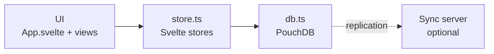

# Offlog — Technical Documentation

Local-first task manager for browser, Android, and Windows. This file is a
reference: what it's built with, how it's laid out, and the few ideas that
aren't obvious from the code.

> Conventions and invariants: [CLAUDE.md](../CLAUDE.md) ·
> Planned work: [roadmap.md](roadmap.md) ·
> Why choices were made: [decisions.md](decisions.md) ·
> Version history: [changelog.md](changelog.md) ·
> Pitch: [README.md](../README.md)

**Contents:** [Stack](#stack) · [Architecture](#architecture) ·
[Source File Map](#source-file-map) · [Data Model](#data-model) ·
[Performance & Reliability](#performance--reliability) ·
[Testing & Dev Workflows](#testing--dev-workflows) ·
[How Sync Works](#how-sync-works) · [Theme System](#theme-system) ·
[View Persistence](#view-persistence) · [Notifications](#notifications) · [Mobile (Android)](#mobile-android) ·
[Desktop (Tauri)](#desktop-tauri)

---

## Stack

| Layer | Technology | Notes |
|---|---|---|
| UI | **Svelte 5** + TypeScript | No virtual DOM, small bundle |
| Build | **Vite 8** | |
| Local database | **PouchDB 9** | IndexedDB in the browser; speaks the CouchDB replication protocol |
| Sync server | Any **CouchDB-protocol** server (CouchDB, or **NyxDB**) | Self-hosted, optional. The app is fully usable without one |
| Android | **Capacitor 8** | Wraps the same `dist/` in a WebView |
| Windows | **Tauri 2** (`offlog-desktop/`) | Wraps the same `dist/`, embeds a NyxDB sync host |
| Notifications | `@capacitor/local-notifications` / Web Notification API | |
| Biometrics | `capacitor-native-biometric` | Android only, opt-in alongside the PIN |
| Privacy screen | `@capacitor/privacy-screen` | Opt-in; also blocks screenshots |
| Clipboard / Haptics / Launcher | `@capacitor/clipboard`, `-haptics`, `-app-launcher` | |
| Styling | CSS custom properties | No CSS framework |
| Fonts | Hanken Grotesk only | `--mono` points at the same face |
| Notes editor | **CodeMirror 6** (`@codemirror/*`, `@lezer/markdown`) | Live markdown rendering in one pane — see `carddetail/MarkdownEditor.svelte` |

**Two TypeScripts, on purpose.** `@typescript/native` is an alias for
TypeScript 7 (the native compiler) and does the real checking, via
`svelte-check --tsgo`. Plain `typescript` is 6.x because svelte-check's
peer range is `^5 || ^6` and it loads the classic TS API. Both packages
ship a `tsc` binary, so `npm run check` calls TypeScript 7 by explicit
path rather than through `node_modules/.bin/tsc` — which shim npm writes
there depends on hoist order, and the gate must not change compiler
silently.

---

## Architecture

Four layers, one direction. The UI never touches the database directly for
state; it reads stores and calls `db.ts`.



- **UI** — `App.svelte` routes between Dashboard, Focus, Agenda, Kanban,
  List, plus modals (CardDetail, QuickAdd, GlobalSearch, Settings). On a
  phone-sized screen (`PHONE_QUERY` in `phone/nav.ts`, the same breakpoint as
  the desktop layout's mobile rules) `<main>` renders `phone/PhoneApp.svelte`
  instead: four tabs (Home, Today, Agenda, Search), each a stack of screens.
  Each shell is its own chunk, imported dynamically only on its side:
  `phone/PhoneApp.svelte` on a phone, `desktopViews.ts` (Sidebar, the five
  views, FilterBar, QuickAdd, GlobalSearch, CardDetail) everywhere else, so
  neither downloads the other. App.svelte awaits the desktop chunk before
  `ready`, so the Tauri window never reveals a half-built UI; App.svelte must
  only ever reference those components through it (a static import pulls them
  back into the main bundle).
  Every pushed screen owns one `modalStack` history entry, so Android back
  pops screens and overlays in one LIFO order; back at a non-Home tab root
  goes Home, and back at Home's root sends the app to the background
  (`CapApp.minimizeApp()`, never `exitApp()`, which would make the next open
  a cold start). With nothing open on Home, App.svelte hands Back to the
  system (`toggleBackButtonHandler`, driven by `modalStack`'s `openLayers`;
  Android 13+ only, and never while App Lock is up) so Android plays its
  predictive-back preview; the manifest sets
  `enableOnBackInvokedCallback`. The plugin flips that switch off the UI
  thread, which leaves Android's own callback on top: `scripts/patch-capacitor-app.js`
  (postinstall) wraps it in `runOnUiThread` until upstream does. The back
  handler also trusts `openLayers` over `canGoBack`: Chrome hides history
  entries pushed without a gesture (a sheet opened from the widget) from it. Re-tapping the current tab at its root scrolls it to the
  top; the + steps aside on a long downward scroll (`fabScroll.ts`). Overdue
  has "All to today", which leaves repeating tasks alone (their due date is
  what the next repeat counts from).
  Week start and 12/24h follow the device locale (`Intl`) until chosen in
  Appearance. Screens: Home, Today/Overdue/Pinned, Search,
  Project (board by status with a drag-following swipe, list with select +
  bulk bar — a held row enters Select — filter and menu sheets; the card
  menu's status pills move a task in one tap) and Statuses, Task (full screen, every field saved as it
  changes, pickers in bottom sheets; order is title, note, fields, steps —
  Status/Due/Priority/Tags always show, the other fields only once set, the
  unset ones as `+` chips opening the same sheets; an empty value reads as a
  muted "—"; dates read "Sun 4 Oct" via `phone/format.ts` `shortDate()`,
  which phone sheets pass to `CalendarPicker`'s `formatDate`), Agenda (list/month), Focus, Settings
  (pushed pages that reuse `settings/*`, plus Recycle bin, History, Archived
  projects, and Organize — spaces, tags and fields in `phone/settings/organize/`
  instead of the desktop manager overlays). Quick add is a bottom sheet that adds where the user is (the
  project and status on show via `nav.addContext`, or Agenda's chosen day).
  `nav.actions` routes task opening, quick add and Settings into the shell;
  `nav.showToast` is the Undo snackbar for reversible actions. Bottom sheets
  are `phone/Sheet.svelte` (a `closeOnBack` consumer: mount behind `{#key}`),
  at z-index 650 so `ConfirmDialog` (700) shows above them. Shared phone
  styles are `phone/phone.css`, all scoped under `.phone-shell`/`.psheet`.
  Only the top screen is mounted; a screen keeps state it wants back (board
  status, filters, sort, search query, Agenda month) on its stack entry via
  `nav.memo()`. Board/List is a per-device choice in localStorage
  (`offlog_phone_view_<projectId>`, first open follows `default_view`); the
  phone never writes the synced `default_view`. Reversible actions (finish,
  move, archive, delete, Focus reset) act at once with Undo; confirms are kept
  for deleting a project, deleting for good, emptying the bin and clearing
  history. Widget and notification jumps use `nav.navigate()`, which waits
  for `closeAll()`'s history jump before pushing. Cross-project rows
  (`phone/TaskCard.svelte`: Today, Overdue, Pinned, Agenda, Search) finish
  through the project list's `toggleDone`, so haptic, snackbar and Undo
  match; holding one opens the board's `CardMenuSheet` through
  `phone/TaskMenu.svelte`. A row drops its date pill when its section
  already names that day. The phone shell never runs in the Tauri window.
  Widget deep links (`com.offlog.app://focus|quickadd|dashboard|agenda|project`)
  arrive through `@capacitor/app` (`getLaunchUrl()` cold, `appUrlOpen` warm)
  and route to `nav.navigate()`; a quick add is queued until the shell has
  mounted. Focus holds three picks in the day's `focusLock.ts` commitment,
  ranked by `phone/focus/rank.ts`, a copy of FocusView's scoring: change
  both. Home applies `livingHero.ts`'s hue/lightness shift on mount and on
  every return to the foreground. `searchAllTasks()` (shared with the desktop's
  GlobalSearch) returns open before done, title matches first, then by due
  date (undated last), then title.
- **store.ts** — the only reactive layer for app data. Holds spaces, projects,
  tasks and the active selection; reloads on any database change.
- **db.ts** — all reads and writes, the changelog, the undo buffer, and
  sync control.
- **Sync server** — optional. All devices replicate through one database
  named `offlog`.

---

## Source File Map

Paths are relative to `offlog-app/`. Every source file is listed except the phone shell's
per-screen sheets, which are grouped by folder.

```
src/
  App.svelte                    Root: view routing, shortcuts, undo toasts, lock gate
  app.css                       All CSS custom property tokens (light + dark)
  config.ts                     Settings in localStorage + secure sync credentials
  main.ts                       Mount entry; global error handlers; status-bar setup
  vite-env.d.ts                 Types for the host-injected globals (Capacitor, Tauri, PouchDB)

  lib/
    db.ts                       Barrel — import everything from here, never from db/*
    db/
      core.ts                   PouchDB instance, indexes, task cache, logChange, subscribe
      entities.ts               CRUD: spaces, projects, tasks, blocked-by, attachments, undo, trash
      sync.ts                   Live replication, sync state, conflict scan/resolve
      tags.ts                   Tag colour overrides, tag rename/delete
      stats.ts                  Dashboard and storage-breakdown aggregate reads
      maintenance.ts            Retention pruning, integrity check/repair, import/export
    store.ts                    Svelte stores — the only reactive state layer
    types.ts                    SpaceDoc, ProjectDoc, TaskDoc, Column, CustomFieldDef
    constants.ts                Priority colours/labels, default columns
    utils.ts                    Date formatting and task filtering (see table below)
    theme.ts                    Light/dark/system, high contrast, reduce motion
    motion.ts                   Shared transition params (panels, toasts). Motion only where it shows origin or progress
    modalStack.ts               Back-button/Escape close ordering — closeOnBack(); a window Escape handler acts only when isTopLayer()
    focusTrap.ts                use:trapFocus action, shared by every modal
    confirm.ts                  confirmAction() — promise wrapper around ConfirmDialog
    commands.ts                 Command palette action list (Ctrl+K)
    discovery.ts                mDNS host discovery + pairing handshake (device side)
    notifications.ts            Reminder scheduling, both platforms
    autoBackup.ts               Silent daily local backup, 7 kept
    attachments.ts              Attachment size cap and extension→mime map
    focusLock.ts                The day's Focus commitment — per-day UI state, never synced
    today.ts                    `today` store: the local date, advancing at midnight
    tagColors.ts                Tag colour: stored override, else deterministic hash
    updateChecker.ts            Desktop update check (Tauri updater plugin)
    spaceIcons.ts               The 25-icon space-icon set and resolver
    logFormat.ts                Turns log: docs into plain English for TimeTravelView
    nlpParse.ts                 parseQuickAdd() — local regex parsing, no network
    haptics.ts                  Single gate for every haptic call (Android only)
    demoSeed.ts                 Demo workspace for `npm run build:demo`; compiled out of normal builds

    desktopViews.ts             The desktop views as one chunk; App.svelte imports it dynamically, never statically
    Sidebar.svelte              Spaces, projects, sync indicator, bottom icon row
    DashboardView.svelte        Home: project cards, pinned/overdue panels, daily brief
    FocusView.svelte            Pick up to 3 tasks for the day; corkboard picker
    KanbanBoard.svelte          Drag-and-drop columns (mouse + touch)
    ListView.svelte             List/table with search, filter, sort, archive
    AgendaView.svelte           Flat list (Overdue/Today/This week/Later) + month grid
    FilterBar.svelte            Search + filter row shared by Kanban and List
    TimeTravelView.svelte       log: docs grouped by day, with pagination
    TaskHistoryPanel.svelte     Lazy-loaded history for one task
    QuickAdd.svelte             Ctrl+N fast add; live-parses the title via nlpParse
    GlobalSearch.svelte         Ctrl+K debounced search across all tasks
    TrashView.svelte            Restore or purge soft-deleted tasks

    CardDetail.svelte           Task editor shell: all card state, save(), history
    carddetail/
      RepeatReminderBlock.svelte  Repeat and reminder
      ChecklistBlock.svelte       Checklist
      CustomFieldsBlock.svelte    Custom field values
      RelatedBlock.svelte         Related tasks
      BlockedByBlock.svelte       Blocking dependencies
      AttachmentsBlock.svelte     File attachments
      NotesBlock.svelte           Markdown notes, via MarkdownEditor
      MarkdownEditor.svelte       CodeMirror 6 wrapper, one live-rendering pane
      markdownLiveView.ts         CodeMirror decorations: bold/italic/heading/etc
                                   render inline as you type, no separate preview
      helpers.ts                  Pure helpers: dates, summary text, image encoding

    SettingsPanel.svelte        Settings shell: category nav, shared state, save/close
    settings/
      AppearanceSettings.svelte   View & Accessibility
      NotificationSettings.svelte Notifications
      SyncSettings.svelte         Sync and pairing
      OrganizeSettings.svelte     Organize
      DataSettings.svelte         Backup & Storage
      SecuritySettings.svelte     App Lock
      AdvancedSettings.svelte     Advanced (sync URL, maintenance, reset)
      helpers.ts                  Pure helpers: download, storage math, maint steps

    SpaceManager.svelte         Manage spaces
    TagManager.svelte           Manage tags and their colours
    CustomFieldManager.svelte   Manage global custom field definitions
    ArchivedProjectsManager.svelte  Archive and restore projects

    CustomSelect.svelte         Themed dropdown, replaces every native <select>
    CalendarPicker.svelte       Themed date picker
    TimePicker.svelte           Themed time picker
    ConfirmDialog.svelte        Themed confirm(), driven by confirm.ts
    NamePrompt.svelte           Desktop first run: device name + quick preferences + sync offer (the phone shows phone/Welcome.svelte)
    UpdateModal.svelte          Desktop update available/downloading/failed
    AppLock.svelte              PIN lock screen; Escape must not dismiss it
    ConfirmPinGate.svelte       Proves the current PIN before changing or removing it
    PinStar.svelte              The shared pin star icon

    phone/                      The phone shell (PHONE_QUERY, never Tauri); its own chunk, loaded by App.svelte only on a phone
      PhoneApp.svelte             Tabs, screen stacks, nav bar, +, snackbar, keyboard handling
      PhoneLock.svelte            The phone lock screen: own keypad, unlocks on a match; App.svelte loads it lazily
      Welcome.svelte              First launch on a phone: one page, no questions; Start or Connect to a computer
      nav.ts                      Tab/stack stores, push/back, navigate(), actions, memo()
      Sheet.svelte                Bottom sheet (closeOnBack consumer: mount behind {#key})
      phone.css                   Shared phone styles and --p-* tokens, scoped to .phone-shell/.psheet
      Home / TaskListScreen / ProjectScreen / StatusesScreen / TaskScreen /
      AgendaScreen / FocusScreen / SearchScreen / QuickAddSheet / NewProjectSheet .svelte
                                  One file per screen or top-level sheet
      TaskCard / TaskMenu / TopBar / Empty .svelte   Shared rows, menus, bars, empty states
      livingHero.ts               Season/evening shift of --hero (--hero-dh, --hero-dl)
      fabScroll.ts                Hides the + on a long downward scroll
      rowMotion.ts                markLeaving/markReturning, leaves/returns: which rows play
                                  lib/motion.ts's collapseOut/collapseIn
      presets.ts                  Due and reminder shortcut lists, shared by quick add and the task screen
      settings/LockPage.svelte    App lock page: PIN forms in sheets, lock time as a picker row
      mark.ts / icons.ts / format.ts  Logo paths, icon set, greeting and labels (shortDate)
      agenda/month.ts             Month grid maths
      focus/rank.ts               Focus suggestions; a copy of FocusView's scoring (change both)
      project/                    Board, list, bulk/filter/card/project menu sheets, actions, filter.ts
      quickadd/                   Quick add panels; memory.ts keeps the last keyboard height
      settings/                   Settings pages (reuse settings/*), Trash, History, Archived, organize/
      task/                       Task-screen sheets and Steps; when.ts has laterToday()
```

**Two CSS rules worth knowing:**

- `CardDetail.svelte` and `SettingsPanel.svelte` own their children's
  **class** rules as `:global()` under a parent wrapper, because the markup
  now lives in child components and scoping would drop it.
- Bare **element** rules (`button`, `label`, `textarea`) must stay scoped
  and be copied into each child. A `:global(button)` also matches nested
  components' internal buttons (CustomSelect, CalendarPicker) and restyles
  them.

---

## Data Model

One PouchDB database, `offlog`. The `_id` prefix is the document type.

| Prefix | Type | Key fields |
|---|---|---|
| `space:` | SpaceDoc | `name`, `color`, `icon`, `position` |
| `project:` | ProjectDoc | `space_id`, `name`, `columns[]`, `default_view`, `archived` |
| `task:` | TaskDoc | `project_id`, `column_id`, `title`, `body`, `priority`, `due_date`, `tags`, `deleted`, `archived` |
| `log:` | LogDoc | `ts`, `source`, `source_id`, `ref`, `action`, then `field`/`from`/`to` or `diffs` |
| `meta:` | Custom field definitions (one doc, `meta:custom_fields`) | `fields[]` |
| `tag:` | Tag colour override | `tag`, `color` |

### Rules

- **Done is positional.** A task is complete when its `column_id` is the
  project's **last** column. There is no `done` boolean, so a task can never
  disagree with the column it sits in.
- **Soft delete.** Tasks get `deleted: true` and are never removed. A real
  removal would replicate as an absence and lose the history.
- **Archive.** `archived: true` hides a task from normal views; restorable.
  Archiving a *project* cascades onto its open tasks and marks each
  `archivedWithProject: true`, so un-archiving restores exactly those and
  leaves any the user archived individually alone. Tasks hidden by a cascade
  from before the flag existed cannot be identified and stay archived.
- **Ordering** uses fractional positions, so inserting between two tasks
  never renumbers the rest.
- **History is best-effort and excerpted.** Every mutation attempts a `log:`
  doc via `logChange()`, which never rejects: a failed log write is a
  `console.warn` (error name only), and the action still resolves, because
  its data write has already landed. Strings longer than 120 characters in
  `from`/`to`/`diffs` (task notes, long custom-field values, checklist
  items) are stored as their first 120 characters plus `…`, never as full
  copies; a diff shortened that way carries `changed: true`, and readers
  must use `isRealDiff()` from `logFormat.ts` rather than compare the
  excerpts. Older entries may still hold full bodies; every view renders a
  notes change as "Notes updated" and never shows its text.
- **Priority** is `1` low, `2` medium, `3` high. The desktop shows it as a
  left border; the phone tints the finish ring for medium and high only, with
  a screen-reader label.
- **Pinned** always sorts to the top.
- **"Status" vs "Column".** Users see "Status". The stored field is
  `column_id` — a frozen legacy name.
- **Source** is the device name that made a write, for the changelog.

### Fields with behaviour attached

- **Recurrence** (`daily`/`weekly`/`monthly`, optional interval,
  weekdays-only): one task per series, not a new card per completion.
  Moving it to the last column writes it back to the first with the due
  date advanced from the *original* date, so finishing late doesn't shift
  the schedule. Undo has to restore due date, reminder and checklist too,
  not just the column.
- **Attachments**: bytes live in PouchDB's own `_attachments` on the task,
  so they replicate with it. `TaskAttachment` holds only metadata (`key`,
  filename, type, size, date) — `key` is not the filename, since two files
  can share one. 10 MB per file, 10 per task. Images are downscaled to
  ~1600px and re-encoded to JPEG before saving.

  Opening one is platform work, not a download: a blob URL on an
  `<a download>` only functions in a browser, so Android writes to cache and
  offers the share sheet and desktop opens a save dialog — the same gap
  `downloadBlob()` documents for exports, but binary rather than UTF-8.
  The filename is treated as data on the way to disk: it rides on the doc, so
  it can arrive over sync or from a hand-edited backup, and `safeFileName()`
  strips directory components and leading dots before either platform writes
  it.
- **Related** (`related[]`): non-directional "see also". Stored only on the
  task the link was added from; the reverse direction is computed at read
  time, because PouchDB cannot write two documents atomically.
- **Blocked by** (`blocked_by[]`): a real directional dependency. Whether a
  blocker is done is computed with the positional rule, so it cannot drift.

---

## Performance & Reliability

**Indexing.** `getTasksForProject()` is the hottest read and uses a Mango
index on `['type', 'project_id']` (~9x faster than a full scan at 5,000
tasks). Note `db.find()` silently defaults to 25 results — always pass an
explicit `limit`.

**Task cache.** Cross-cutting reads (search, dashboard, agenda, tag
autocomplete) each need *every* task, which no index can narrow.
`getAllTasksRaw()` caches that full scan in memory. Invalidation happens
centrally in `subscribe()` and again inside every task-writing function, so
a read can't beat the change listener. Each invalidation bumps a generation number; a reload or
catch-up only marks the cache current if none landed while it was reading.

**Change feed.** `subscribe()` shares one live PouchDB feed across every
subscriber (opened with the first, closed with the last). The cache is
invalidated on each change, but subscribers are called once per 50ms quiet
period, so a sync burst of hundreds of docs costs each screen one reload.
If the feed dies it restarts after 2s and notifies everyone, since changes
during the gap were never delivered.

**Crash recovery.** `App.svelte` wraps startup in try/catch and shows a
retry screen rather than hanging. `main.ts` listens for `unhandledrejection`
and `error` as a last resort. Every task-mutating call site is wrapped in
try/catch with `showError()` — an audited invariant.

**Integrity check.** `checkIntegrity()` reports nine issue types: orphaned
projects and tasks, tasks pointing at a status that no longer exists,
projects with no statuses, unresolved sync conflicts, values left behind by
a deleted custom field (`removeCustomFieldDef()` sweeps them itself, so
this catches only ones synced in from a device running an older build), `related`/`blocked_by` ids pointing at tasks that
were hard-pruned, active tasks inside an archived project, and
`attachments[]` metadata that disagrees with PouchDB's own `_attachments`.

`repairDatabase()` fixes all but two, which are left for a person:
the no-statuses case, and **conflicts**. Conflicts are never auto-resolved --
keeping whichever revision PouchDB calls the winner is arbitrary, not "most
recent", so auto-repair would silently discard one device's edit.
`scanConflicts()` already auto-settles the only safe case (a pristine default
against a real edit), so anything still standing is a genuine disagreement;
Settings -> Sync -> Resolve conflicts is where it gets decided. It accepts the issue list a caller already computed —
`runMaintenanceSteps()` passes its own, so a run scans once rather than
two or three times. Repair rewrites documents and drops conflicting
revisions with no undo, so it asks first: `MaintOptions.confirmRepair` is a
callback (db/ must never import UI) that SettingsPanel fulfils with
`confirmAction()` and the phone's `PrefsPage` with its own confirm. Declining leaves the data untouched and reports the
issues as needing review.

It reads every doc except the changelog, in two `allDocs` range scans either
side of `log:` (`conflictBearingRows()` in `db/sync.ts`), so the changelog is
not loaded — and `checked` counts only records a check actually inspected.
Not a per-prefix allowlist: the same rows feed the conflict pass, and an
allowlist there stops reporting conflicts on docs outside it (such as
`meta:custom_fields`) that the sync badge still counts. `log:` docs are excluded from the
conflict pass on purpose: their ids embed a random suffix, so two devices
can never mint the same one.

**Maintenance run.** `runMaintenanceSteps()` sequences check → repair →
prune history → prune trash → compact, reporting each through `onStep`.
`MaintOptions.isCancelled` is polled between steps; a step already in
flight always finishes, since neither a `bulkDocs` nor a compaction can be
interrupted safely.

Compaction is the expensive step: PouchDB's `_compact` walks the changes
feed from seq 0 and fires one `compactDocument()` per row concurrently, so
on a churned database it queues thousands of IndexedDB transactions and
starves the main thread for minutes. It is also usually pointless — the
database is opened with `auto_compaction`, so revision bodies are discarded
as each write lands. So it runs exactly once and never again -- not
"whenever this run deleted something": a repair only rewrites docs and a
prune only tombstones them, and in both cases the old bodies are already
gone, so that rule would pay the full walk for zero bytes. Databases
predating `auto_compaction` get the one real pass, marked done in
`offlog_compacted`.

Every purge (Empty Recycle bin, delete forever, retention pruning, deleting a
project, clearing history, a data reset) writes a bare
`{_id, _rev, _deleted: true}` tombstone (`tombstone()` in `entities.ts`). A
deleted revision that kept the doc's fields would keep its `_attachments`
digests, so the blobs were never freed, and it replicated the deleted
content to every paired device.

**Automatic backup** (`autoBackup.ts`). Runs at most every ~20h, writing the
same JSON as a manual export to app-private storage (desktop
`appDataDir()/auto-backups/`, Android `Directory.Data`; no-op on web). Keeps
the newest 7. Plain unencrypted JSON, on-device, never uploaded. Failures
are logged and retried next run — the timestamp only advances on success.
A stored timestamp in the future (the clock was once set ahead) counts as
due, as do the retention stamps; otherwise all three stall until real time
catches up.

**Restore** (`importJSON()`) updates docs in place. A one-project export
inlines attachments like the full backup; for an older file that carries
only `{stub: true}` entries, a stub whose key the live doc still holds keeps
that attachment rather than deleting it. `meta:custom_fields` is merged by
field id (the backup's definition wins on the same id), never replaced: a
field created after the backup keeps its definition, so Repair doesn't
erase its values.

Each file is a full snapshot with attachments inlined as base64, so the
folder grows with attachment size, not task count: 5.7 MB of attachments
measured at 6.2 MB per file and 43 MB across the seven kept. That storage
sits outside IndexedDB, so `navigator.storage.estimate()` — what Settings'
storage headline reads — does not count it. `getAutoBackupUsage()` reads the
folder so the figure appears alongside the database breakdown instead of
being invisible. Collecting the JSON is not the cost: 762 docs with 5.7 MB
of attachments took 55 ms end to end.

### Shared utilities (`utils.ts`)

| Export | Used by |
|---|---|
| `dueLabel` | Kanban, List |
| `dueLabelLong` | Dashboard, Agenda |
| `dueRelative` | Agenda |
| `dueInk` | ListView |
| `filterTasks` | ListView, Kanban, `phone/project/filter.ts` |
| `localDateStr` and friends | everywhere a calendar day matters |

All date-only logic goes through `localDateStr()`. Never use
`toISOString().slice(0, 10)` for a calendar day — it shifts to UTC.

**Day rollover (`today.ts`).** Views stay mounted across midnight (the
desktop is tray-resident), so anything that labels or groups by "today"
reads the `today` store, never a date captured at mount. It is a lazy
`readable` holding `localDateStr(now)`: one `setTimeout` to the next local
midnight (built from calendar fields, so DST days are 23/25 h), re-armed
on every fire, plus an immediate re-check on `visibilitychange`, `focus`
and Capacitor's document `resume`, since timers stall while a device
sleeps. The timer and listeners exist only while something is subscribed.
Templates pass `$today` into the due helpers (`dueLabel`, `dueInk`,
`dueLabelLong`, `dueRelative`, phone `duePill`, `dateFromToday`), whose
optional `today` argument makes the expression re-run at midnight; screens
whose groups come from a query (Dashboard, Focus, phone Home/Today/Agenda/
Focus) reload through `onNewDay()`, which skips the current day.

---

## Testing & Dev Workflows

Full test conventions live in [CLAUDE.md](../CLAUDE.md). In short: `db.ts`
logic runs against `pouchdb-adapter-memory`, components run under
`@testing-library/svelte` with `db`/`store` mocked, and three suites test
the real thing — `replication.test.ts` (PouchDB's actual replicator between
two databases), `backupRestore.test.ts` (export → wipe → restore), and
`perfGuard.test.ts` (counts database round-trips, never wall-clock time).

`tests/setup.ts` shims what jsdom lacks: the `PouchDB` global, an in-memory
`localStorage` (Node's own global shadows jsdom's), `Element.animate`,
`matchMedia`, and `scrollIntoView`.

`npm run bench` (`tests/perf.bench.ts`, `tests/scale.bench.ts`) is a separate
Vitest benchmark over the hot read paths. It is not a CI gate — `perfGuard.test.ts` is, since
round-trip counts are stable across machines and wall-clock times are not.

### CI (`.github/workflows/`)

- **`ci.yml`** — on `offlog-app/**`: version consistency, type-check,
  zero-warning build, tests.
- **`desktop-ci.yml`** — on `src-tauri/**` and the NyxDB fetch script: a
  real release `cargo build`, which also warms the cache release runs
  restore. Deliberately not all of `offlog-desktop/**` — dev-only scripts
  and `mdns-browse/` must not spend a release build.
- **`codeql.yml`** — JS/TS, Rust and Actions, all build-mode `none`.
- **`codeql-android.yml`** — Java/Kotlin, the only analysis needing a real
  build. Scoped to `android/**`, `capacitor.config.ts` and
  `package-lock.json`, since nothing else can change its result. Compiles
  with `compileDebugJavaWithJavac` rather than `assembleDebug` — CodeQL
  needs javac traces, not dexing or packaging — and caches Gradle
  dependencies, which `release.yml`'s tag build also restores.
  `gradle.properties` enables `org.gradle.parallel` and
  `org.gradle.caching` for release builds; this job compiles with
  `--no-build-cache`, because a cached compile never runs javac and CodeQL
  then sees no source. The JDK must be
  installed *before* CodeQL init or the extractor sees no source.
  `node_modules` is excluded via `codeql-config.yml`.
- **`release.yml`** — on a `vX.Y.Z` tag: builds the Android APK (signed with
  the real key when the signing secrets are set, else the debug key) and the
  Windows installer, attaches both to a draft Release.

Every workflow except `release.yml` cancels superseded in-flight runs for
the same ref.

### Windows distribution

The Windows installer is **not code-signed**. Paid certificates were ruled
out as incompatible with how this project is distributed; a free path may be
adopted later if one exists that doesn't require payment. Until then Windows
shows an "unknown publisher" prompt on first install. Android's equivalent
warning is handled by the Play Store listing instead.

The desktop **updater** has its own signing key (generated once, stored only
as a GitHub Actions secret) — unrelated to code signing, and already in use.

It reads `releases/latest/download/latest.json`, which resolves through two
redirects: GitHub first works out *which* release is latest, then serves that
tag's asset. Two consequences, both normal:

- A **draft** release is invisible to it. `release.yml` creates drafts on
  purpose, so the updater only offers a version once it is published.
- For a few minutes after publishing, that first redirect can still resolve
  to the previous tag, and the app correctly reports itself up to date. It is
  propagation lag, not caching — the redirects carry `Cache-Control:
  no-cache` and `checkForUpdate()` has no throttle of its own.

### Generating test data

- **`scripts/seed-scenario.js`** — paste into the DevTools console. Covers
  every feature with randomized content, including deliberately messy cases
  (duplicate titles, near-duplicate notes). Calls `db.ts`'s own functions,
  so it can't drift from its invariants.
- **`scripts/seed-demo.js`** — a hand-authored, deterministic dataset (one
  persona, 4 spaces, 13 projects) for reproducible screenshots. Use its
  `WIPE_EXISTING: true`.
- **`npm run build:demo`** — a test build (`.env.demo`, `VITE_DEMO_DATA=1`)
  whose fresh install fills itself with the same demo workspace
  (`src/lib/demoSeed.ts`, once per install). Debug APKs for phone testing are
  built from it. A normal `npm run build` compiles the branch out — no demo
  code ships.
- **`scripts/seed-full.js`** — the big one: every writable feature at
  volume, to **exact** counts (10 spaces, 30 projects, 500 tasks, and a
  fixed number of checklists, custom values, reminders, links and so on).
  The `TARGET` block at the top is the contract; the summary reports what
  actually landed and warns on any mismatch, so a shortfall is visible
  rather than assumed. `WIPE_EXISTING` defaults to **true** — the counts
  are only meaningful on an empty database.
  Covers what the other two don't: recurrence intervals and weekdays-only,
  blocked-by in both resolved and unresolved states, attachments on both
  the image and non-image branches, projects from a template with and
  without tasks, every column shape with every column populated, column
  add/rename/remove/reorder, tag rename, and all four custom field types.
  It also re-dates the changelog: every write stamps a log at "now", so a
  post-pass thins them and spreads them back over 120 days.
  **Run it from the DevTools console, not by serving it from `public/`** —
  writing into `public/` (or running `npm run build`/`vitest`) while the
  dev server is up triggers a full page reload that kills the run partway.
  Expect a few minutes at 500 tasks: creation slows as the database grows,
  since every write invalidates the task cache and the mounted UI
  re-renders on each change.

- **Anything smaller** — write straight to `new PouchDB('offlog')` in the
  console. Assign `column.id`, never the column object, or the task renders
  nowhere. Reload afterwards so the task cache picks it up.

### Resetting to a fresh state

Do this after any real test round; dev state accumulates silently.

- **Desktop**: `offlog-desktop/scripts/reset-dev-env.ps1` — debug-build files only (see
  the debug/release table under Desktop). `-IncludeRelease` also wipes the
  *installed* app's host config, NyxDB data and `Offlog.log` — only when
  confirmed disposable. It never touches the release WebView2 profile.
- **Web**: `new PouchDB('offlog').destroy().then(() => localStorage.clear())`,
  then reload. Clearing PouchDB alone leaves `offlog_seeded` set and produces a
  zero-spaces state that no real install ever has.
- **Android**: `adb shell pm clear com.offlog.app.debug`, or reinstall.
- **Automatic backups** live outside PouchDB and survive a `destroy()`.

### Debugging sync discovery

`offlog-desktop/mdns-browse/` is a ~20-line script that browses for
`_offlog._tcp` and prints what it finds. `npm install && node browse.js`. It
answers the first question behind most sync failures: is the PC advertising,
and can the phone see it? That separates a discovery problem from a pairing
or replication one.

---

## How Sync Works

**The idea.** Every device keeps a complete copy of the database and works
offline. There is no server that owns the data — the optional sync server is
just another copy that all devices can reach. When two copies meet, they
exchange whatever the other is missing. Turn sync off and nothing breaks;
you simply stop exchanging.

**Why PouchDB.** It implements the CouchDB replication protocol, which
solves the hard part: each document carries a revision history, so two
copies can work out what changed without a central coordinator. The server
can be real CouchDB or NyxDB (the small Rust server the desktop app embeds)
— the app only needs something that speaks the protocol.

**What actually happens.**

1. `startSync()` opens a live bidirectional replication with the configured
   server.
2. A local write replicates out immediately.
3. A remote change fires a `.changes()` event; `store.ts` reloads.
4. Offline, writes queue locally; replication resumes on reconnect. On
   Android, Capacitor's `resume` also restarts it (`syncOnResume()`): a long
   background grows PouchDB's retry backoff to 5–10 minutes without the
   WebView ever seeing an `offline` event.

**Conflicts.** If two devices edit the same task while apart, both revisions
survive and PouchDB picks a deterministic winner. The loser stays as a live
branch until something resolves it — resolving means removing every losing
revision explicitly, including one whose content you adopted. Conflicts are
counted after each sync and shown as a badge; resolution is available in
Settings. The screen passes the revisions it displayed to `resolveConflict()`,
which refuses (`ConflictChangedError`) if sync changed them in the meantime.

**Sync state** (`syncState`) tracks more than idle/error:

- `lastSynced` persists to `localStorage`, or the sidebar reads "Not synced
  yet" after every restart.
- Offline is its own status, not an error — a failure while
  `navigator.onLine` is false would otherwise look like a server problem.
  Coming back online triggers a sync.
- `describeSyncError()` turns raw 401/403/404/network errors into short,
  actionable text.
- `retryCount` surfaces how many consecutive attempts have failed.

---

## Theme System

All colours are CSS custom properties in `app.css` — `:root` for light,
`body.dark` for dark. Outside `app.css`, colours are hand-kept copies only
where CSS can't reach: Android `values/colors.xml` / `values-night/colors.xml`,
`theme-color` in `index.html`, `public/theme-init.js` and `theme.ts`, and
`constants.ts`'s `PRIORITY_COLOR`. Each mirrors a token and must move with it. Derived tints use
`color-mix(in srgb, var(--accent) X%, transparent)`.

| Token | Light | Dark | Role |
|---|---|---|---|
| `--bg` | `#F6F7F9` | `#181A20` | page background |
| `--surface` | `#FFFFFF` | `#242934` | cards, panels |
| `--sidebar-bg` | `#FBFBFC` | `#101218` | sidebar (follows theme) |
| `--statusbar-fill` | `#f6f7f9` | `#181a20` | Android status-bar strip. `--bg` at rest; `body.statusbar-hero` makes it `--hero`, and `body.statusbar-band` makes it the claiming screen's `--statusbar-band` (deepened 62% into `--bg` in dark). Claims go through `theme.ts` (`setStatusBarOnHero`, `claimStatusBar`; latest live claim wins), applied after the native icon style lands |
| `--col-bg` | `#ECEEF2` | `#1E222C` | Kanban column fill |
| `--border` | `#E2E4EA` | `#2F3542` | hairlines |
| `--border-strong` | `#C7CBD6` | `#3F4657` | stronger dividers, scrollbar |
| `--state-hover` | `8%` | `8%` | hover tint alpha; `16%` in both high-contrast blocks |
| `--state-press` | `12%` | `12%` | pressed tint alpha; `22%` in high contrast |
| `--hover` | derived | derived | `color-mix(--text, --state-hover, transparent)` — a tint of the element's own ink, so it is visible on any ground, including `--col-bg` |
| `--press` | derived | derived | same, at `--state-press` |
| `--hover-on-surface` | derived | derived | opaque form, for a control with a solid `--surface` rest fill |
| `--hover-on-col` | derived | derived | opaque form, for a solid `--col-bg` rest fill |
| `--text` | `#1F2937` | `#F3F4F6` | primary ink |
| `--muted` | `#4B5563` | `#A3A9B7` | secondary ink |
| `--faint` | `#5F6674` | `#8B93A5` | tertiary ink, placeholders |
| `--accent` | `#575FCA` | `#8590E5` | indigo — buttons, active states |
| `--accent-ink` | `#4C54BD` | `#9AA3EE` | accent text on an accent tint (selected pills, "Today"), 4.5:1 where plain accent falls short |
| `--check-ring` | `--faint` 75% | `--faint` 75% | unticked check circle/box border, 3:1 against cards (declared on `body`) |
| `--on-accent` | `#FFFFFF` | `#181A20` | ink on accent/overdue/due-soon/faint backgrounds |
| `--hero-base` / `--hero` | `#575FCA` | `#373D81` | the phone Home's hero band; dark deepens it instead of using the lighter dark accent. `--hero` is the base shifted by `--hero-dh` / `--hero-dl` on `<html>` (season and evening, `phone/livingHero.ts`) where relative colour is supported |
| `--amber` | `#C98A2B` | `#EFC365` | decoration only (phone Settings icon tiles); never carries meaning and is not a brand colour |
| `--on-hero` | `#FFFFFF` | `#EFF0FC` | ink and the muted mark on `--hero` |
| `--ink-fixed-dark` | `#181A20` | `#181A20` | ink on `--success`, which is bright in both themes |
| `--danger` | `#BD4138` | `#E77F7C` | destructive actions |
| `--success` | `#5ABE73` | `#74D791` | done, sync ok |
| `--due-soon-bg` / `--due-soon-ink` | `#FAF3D4` / `#884826` | `#372F1A` / `#EFC365` | due today/tomorrow chips |
| `--overdue-bg` / `--overdue-ink` | `#F8E4E4` / `#AB3730` | `#351A21` / `#EA7F8C` | late chips and counts |
| `--toggle-knob` | `#FFFFFF` | `#FFFFFF` | fixed — track carries the theme swap |
| `--inverse-surface` / `--on-inverse` / `--inverse-accent` | `#2B313D` / `#F3F4F6` / `#A9B0F0` | `#353B49` / `#F3F4F6` / `#A9B0F0` | phone snackbar and bulk-select bar; a raised grey in dark mode, never a near-white slab |

The saturated colours are deliberately muted (OKLCH chroma ×0.8, same hue and
lightness, every text pair still AA). User-picked space and tag colours are
stored as picked and muted at render time by `soften()` in `tagColors.ts`, so
seed detection and tag-colour balancing still see the original hex. `soften()` uses CSS relative colour syntax (`oklch(from …)`, Chromium 119+); an older WebView drops the declaration and the dot or tint goes blank.

`body.high-contrast` / `body.dark.high-contrast` also raise `--border`,
`--border-strong`, `--text`, `--muted` and `--faint` (never the meaning
colours). Phone-only type and shadow tokens (`--p-fs-*`, `--p-shadow`) live in
`phone/phone.css`, scoped to `.phone-shell`/`.psheet`.

Changing `--accent` or `--hero-base` also means updating `capacitor.config.ts`'s
`iconColor`, Android's `values/colors.xml` (`colorPrimary`, `colorAccent`,
`splashBg` = `--hero-base`, and the `colorWidget*` set) and
`values-night/colors.xml` (`splashBg` and the `colorWidget*` set only), and
`resources/generate-icons.cjs`'s `BRAND` (currently `#575fca`). The widget
colours mirror `--text`/`--muted`/`--accent`, with `colorWidgetBg` on `--bg`
in light and `--surface` in dark; `colorWidgetSurface` is a widget-only
shade. The `resources/generate-*.cjs` scripts need `sharp`, which is not a
dependency: run `npm i --no-save sharp` in `offlog-app/` first.
`<meta theme-color>` is not an accent: it follows the theme background
(`#f6f7f9` / `#181a20`), set pre-paint by `public/theme-init.js` and kept in
step by `theme.ts`.

Dark mode is applied before first paint by `public/theme-init.js`, so there
is no flash of light.

**Note:** `SettingsPanel`'s panel is a DOM *sibling* of the sidebar, not a
descendant. Both read page-level tokens; neither inherits from the other.

---

## View Persistence

The last desktop view is saved to `offlog_view` in `sessionStorage` as
`{ view, projectId, mode }` and restored on reload within the session.
Active space and project ids are saved separately in `localStorage` so the
sidebar highlights correctly. The phone shell always opens on Home.

---

## Notifications

`notifications.ts` handles both platforms. It imports `db.ts`; `db.ts` never
imports it, so there is no cycle.

**Reminder field.** `reminder_at` is an absolute ISO timestamp, independent
of `due_date`, converted to and from local time explicitly.

**Scheduling model: cancel all, reschedule from scratch.** `rescheduleAll()`
runs from `store.ts`'s `reload()`, which already fires after every local
mutation and every incoming sync change. It fetches all active tasks with a
future reminder, cancels everything scheduled, and re-schedules. Completing,
deleting or archiving a task simply drops it from the query, so its
notification disappears with no special-casing. At personal scale this is
cheaper than tracking every call site.

**Android** hands scheduling to the OS (`AlarmManager`), so reminders fire
with the app fully closed. Task ids are hashed to a 32-bit integer because
the plugin requires numeric ids. Tapping a notification opens that task;
its **Done** and **Snooze 1h** actions act on the task directly.
Quiet hours (`applyQuietHours()`) push a reminder that would land inside
them to their end, staggered, on both platforms.
Needs `POST_NOTIFICATIONS`, `SCHEDULE_EXACT_ALARM` and
`RECEIVE_BOOT_COMPLETED`. Exact alarms are requested only while
`exactAlarmState` is `granted`: the plugin's `schedule()` opens the system
"Alarms & reminders" page by itself for any exact request without the grant,
which would happen on every launch. Without it reminders are scheduled
inexact, and the first reminder newly set in a launch bumps
`exactAlarmNudge`; the phone shell turns that into a "Reminders may be a few
minutes late · Turn on" snackbar. Settings › Notifications shows the same
fix as a warning row. The plugin's `schedule()` likewise asks for
`POST_NOTIFICATIONS` by itself, so `scheduleNative()` schedules nothing
until that is granted: Android asks at the first reminder the user sets
(task reminder sheet or quick add), never at launch, and
`requestPermission()`/`recheckGrants()` reschedule once it is. A fresh
install's "not asked yet" reads as `default`, not `denied`. On every return to the foreground `recheckGrants()`
re-reads both grants and reschedules everything if the exact-alarm grant
changed.

**Web** is best-effort: there is no push backend by design, so notifications
use `setTimeout` while the tab is open, plus a catch-up on load that fires
anything that came due in the last 24 hours (`CATCH_UP_WINDOW_MS`); an
older missed reminder is cleared from its task. Permission is requested lazily,
never on load.

---

## Mobile (Android)

Capacitor wraps the same `dist/` in a WebView — same PouchDB, same sync,
same UI.

- **Touch drag on Kanban**: HTML5 drag events don't fire on touch, so Kanban
  uses `touchstart`/`touchmove`/`touchend` with `document.elementFromPoint`.
- **Status bar**: targetSdk 36 forces edge-to-edge, and
  `StatusBar.setBackgroundColor()` is a hard no-op from API 35. The app
  embraces it instead: content draws behind a transparent bar, and a
  `.status-bar-fill` strip of `env(safe-area-inset-top)` sits behind it.
  Needs `viewport-fit=cover`.
  While the phone Home's hero is under the bar, Home holds a
  `claimStatusBar({ lightIcons: true })` (theme.ts): light icons, and
  `body.statusbar-hero` (strip = `--hero`) once the native call resolves, so
  the strip never changes ahead of the icons; scrolling the hero away or
  leaving Home clears it. `setStatusBarOnHero()` is only for the phone
  loading screen, which is `--hero` too, continuing the launch splash
  (`splashBg` in android colors.xml). `setStatusBarSuppressed(locked)` drops
  every tint while App Lock covers the app, and `stripVisible()` skips the
  tint when the strip is 0px tall (WebViews that report no top inset), where
  light icons would vanish on the system's light bar. The strip sits below every modal
  scrim (z-index 299), so dialogs and sheets dim it with the page.
  A project screen's header sits on a band in its space's colour (Home's
  diagonal edge; dark mode mixes it 62% toward `--bg`; ink is light unless
  the colour's luminance is high) and tints the strip the same way through
  `claimStatusBar()`. Claims stack: the newest live one wins and releasing it
  hands the strip back, so a screen whose outro ends after the next screen
  claimed cannot undo that claim.
- **Phone shell and the keyboard**: the WebView resizes (`adjustResize`), so
  PhoneApp hides the navigation bar and + button while a text field is
  focused, the page is not pinch-zoomed, and the visual viewport is more than
  150px shorter than its tallest height at this width (re-checked on
  focusin/focusout, so moving between fields keeps it right). On the phone,
  delete-undo goes through the shell's snackbar and `showError` toasts drop
  in at the top (`pointer-events: none`, so the top bar stays usable).
  In quick add a picker panel and the keyboard never share the screen:
  opening a panel blurs the title; a pick, Done, or a tap on the title
  refocuses it inside that tap (Android only raises the keyboard for a focus
  made during a user gesture) and closes the panel. The panel is sized to
  the last keyboard height measured (`phone/quickadd/memory.ts`: the drop
  below the tallest visual viewport at this width; 280px until one is
  seen), so the title row stays put when one swaps for the other.
- **Quick add parse feedback**: `parseQuickAdd()` also returns `spans`
  (offsets into the typed text). The title `<input>` has transparent text
  over an `aria-hidden` mirror that draws the same text with those spans
  tinted; the two share font, line-height and padding, and the mirror
  copies the input's `scrollLeft`. Tapping a tinted token offers "Keep as
  text", which inserts a `\` before it — the parser's per-token escape — so
  the choice lives in the text and survives edits. Chips with a value sort
  first. The default project is the last one added to from Quick add
  (`offlog_quickadd_last_project` in localStorage), after an `@mention` or
  the opening project's context.
- **Notification icons** must be white silhouettes with transparency, or
  Android substitutes a generic triangle.
- **Home-screen widget** (`OffologWidgetProvider.java`,
  `res/xml/offlog_widget_info.xml`): one widget, "Quick actions", with Focus,
  Quick Add and Home shortcuts. Its colours (`colorWidget*` in
  `values[-night]/colors.xml`) are app.css tokens and follow the system
  light/dark setting; the corner radius is the launcher's own on Android 12+.
  `updatePeriodMillis="0"` means `onUpdate()` only
  runs when an instance is placed — a widget already on the home screen
  keeps stale PendingIntents until it is removed and re-added, or the
  device reboots.
- `enterkeyhint` on inputs; breakpoints at 900/768/600/440px; `source` is
  the device name.

```bash
npm run build && npx cap sync android
# then build in Android Studio (owner-only)
```

---

## Desktop (Tauri)

`offlog-desktop/` sits beside `offlog-app/` in this repo. Its
`frontendDist` points at `offlog-app/dist`, so it wraps the exact same build
the browser and Android use. The only new code is Rust.

**Embedded sync host** (`sync_host.rs`). On first launch it generates a
random port and admin password, saves them to
`app_data_dir()/sync-host.json`, and spawns
[NyxDB](https://github.com/hrach-gevorgyan/nyxdb) as a child process
configured entirely by environment variables — no config file. A Windows Job
Object (`JOB_OBJECT_LIMIT_KILL_ON_JOB_CLOSE`) ties that process to the app's
lifetime on every exit path, including a crash. The binary is built by
`scripts/fetch-nyxdb-win.ps1` from a pinned tag and is not committed.

`sync-host.json` is the host's identity; regenerating it breaks every
paired phone. It is written via temp file + rename. A file that won't
parse is renamed to `sync-host.json.bad-<unix-secs>` (with a log warning)
before a new identity is generated; one that can't be read at all gets a
session-only identity and is left on disk. Database creation, the pairing
server and mDNS run once NyxDB accepts connections: after the first 20 s
the background thread keeps re-checking with a 1 s → 30 s capped backoff
for as long as the sidecar process is alive, so a slow start delays
pairing instead of disabling it for the session.

**Supervision.** The same background thread then polls the sidecar every
5 s (`supervise_nyxdb()` in `lib.rs`). If NyxDB exits on its own it is
restarted with the same binary, data dir, port and credentials, inside the
original Job Object (`sync_host::respawn_nyxdb()`), then readiness and
`ensure_database` run again. Backoff and the give-up rule are the pure
`sync_host::RestartPolicy`: 2 s doubling to a 60 s cap, and the 5th exit
within 5 minutes stops restarting for the session (logged as an error). A
failed respawn counts as another exit. The pairing server and mDNS start
once per session, the first time NyxDB is ready, never again on restart.
Deliberate teardown — `terminate_nyxdb()` (tray Quit, `ExitRequested`) and
debug `reset_sync_data` — sets `NYXDB_STOPPING` before killing, and the
supervisor re-checks it under the `NyxdbProcess` lock before respawning,
so a quit is never mistaken for a crash.

**Debug vs release on one machine.** Both share the identifier, so
`app_data_dir()` and `app_local_data_dir()` are the same folders. Every
per-build file is split on `debug_assertions`; release names are the
originals and must never change:

| | release | debug |
|---|---|---|
| host identity | `sync-host.json` | `sync-host.dev.json` |
| NyxDB data | `nyxdb-data/` | `nyxdb-data-dev/` |
| stored sync credential (DPAPI) | `sync-secret.enc` | `sync-secret.dev.enc` |
| WebView2 profile (IndexedDB, localStorage) | `%LOCALAPPDATA%\com.offlog.app\EBWebView` | `…\com.offlog.app\webview-dev\` |
| log | `…\com.offlog.app\logs\Offlog.log` | `…\logs\Offlog-dev.log` |

The WebView2 split matters because both builds load the same
`tauri.localhost` origin: without it a dev run reads and writes the
installed app's PouchDB tasks and `offlog_sync_url`. Debug builds set
`create: false` on the config window in `run()` and build it in `setup()`
with `.data_directory(...)`; release builds keep Tauri's own window
creation. A debug build from before this split used the shared profile,
so dev data written then lives in the release profile.

**Discovery and pairing** (`discovery.rs`, `pairing.rs`, `discovery.ts`).
The PC advertises `_offlog._tcp` over mDNS carrying a uuid and pairing port
— deliberately no credentials over the air. Pairing is a separate
single-endpoint HTTP server: the PC shows a 6-digit code, single-use, valid
5 minutes; the phone posts a PBKDF2-derived proof of it (never the code
itself) and gets the real credentials back AES-256-GCM-encrypted under a
key derived the same way — see [security.md §1](security.md#1-connecting-a-phone-to-your-pc-pairing)
for the full protocol and its honest limits. There are no fixed username/password
constants, because nothing could match a per-install random password.
The pairing server logs only outcomes — "succeeded" and a running count of
rejected requests — never the code, proof, nonce or response.

**Sync URL resolution is three-way**, which is easy to get wrong:

| Platform | Default | Why |
|---|---|---|
| Android | `''` | No way to guess an address |
| Desktop web | `127.0.0.1:5984` | Assumes a manually installed server on CouchDB's port |
| Tauri | resolved at boot | Its sidecar binds a *random* port, never 5984 |

`initTauriSyncDefaults()` runs before `startSync()` and asks the Rust side
for the real address. Skipping it points the desktop app at whatever else is
listening on 5984.

**Tray-resident** (`lib.rs`). Closing the window hides it; the only quit
path is the tray menu, which reuses the same NyxDB cleanup as a graceful
exit. Tray menu: Show / Quick Add / Settings / "Start on login" (reads the
real registry state) / Quit. A global `Ctrl+Alt+O` lands on Dashboard —
Quick Add already has Ctrl+N, so this one's job is just getting back in
fast. `bring_to_front()` toggles `always_on_top` true→false because a bare
`set_focus()` is ignored by Windows' foreground-lock timeout when called
from a background thread.

**Content Security Policy** (`tauri.conf.json`). `script-src 'self'` (the
pre-paint theme script is same-origin); `style-src` allows `'unsafe-inline'`
for per-space colour attributes; `img-src 'self' blob:` (image attachments
are shown from blob URLs); `connect-src 'self' http://*:* https://*:*` — the
`:*` is **required**, since a bare `http://*` means port 80 only and every
real sync target uses a random port. Everything else is locked down:
`object-src 'none'`, `frame-ancestors 'none'`, `base-uri 'self'`,
`form-action 'self'`.

**Installer** (NSIS). `sidebarImage` is a brand-matched 24-bit BMP generated
by `offlog-app/resources/generate-installer-art.cjs` — NSIS requires classic
uncompressed 24-bit BMP specifically. There is deliberately **no
`headerImage`**: NSIS fills the rest of that bar with plain white and MUI2
offers no supported way to recolour it, so a dark header clashes instead of
reading as a banner.

```bash
cd offlog-app && npm run build
cd ../offlog-desktop
powershell -ExecutionPolicy Bypass -File scripts/fetch-nyxdb-win.ps1   # once
cargo tauri build
```

---

## Version History

See [changelog.md](changelog.md). Don't duplicate it here or in README.md.
